# Pulse — MVP Implementation Plan

**Product:** Local AWS serverless development platform ("VS Code for serverless") — run, trigger, and inspect Lambda-based apps entirely on a laptop, with high-fidelity service mocks and instant feedback. Based on the PRD (`Executive Summary.pdf`), narrowed to a shippable MVP.

**Working name:** `pulse` (from this folder). CLI `pulse`, config `pulse.yaml`. Trivial to rename — flagged as an open question.

**Decisions locked (2026-07-29):**

| Decision | Choice | Why |
|---|---|---|
| Core engine language | **Go** | Single static binary, goroutines fit the router/mock workload, <1s startup, trivial cross-compile. PRD's lean + existing Go familiarity. |
| Delivery strategy | **Staged demoable slices** | Each milestone is independently usable; we re-scope between slices instead of one big reveal. |
| Interface | **CLI first, headless engine; desktop UI second** | Engine exposes a local HTTP/WS control API from day one. CLI and (later) the Tauri UI are both thin clients of it. |
| Desktop shell (M5) | **Tauri 2 + React/TypeScript**, Go engine as sidecar | PRD recommendation: ~10MB shell vs ~100MB+ Electron, low memory, React per PRD. |
| Persistence | **SQLite** (single `state.db`) + real files for S3 objects | PRD recommendation. Pure-Go driver (`modernc.org/sqlite`) → no cgo, clean cross-compile. |
| Runtimes at MVP | **Node.js 18/20/22, Python 3.9–3.12** | PRD Phase 1. Go/Java/.NET post-MVP via the same adapter interface. |
| Containers | **None** | Native processes only, per PRD's performance stance. |

---

## 1. MVP definition & done criteria

> **Guiding principle (2026-07-29, per Geetansh):** solve ONE complete workflow
> exceptionally well rather than partially supporting many AWS services. The
> workflow: **a typical CRUD + background-job application — built, run,
> debugged, inspected, replayed, and iterated entirely offline.** Everything
> else (SNS, S3, EventBridge, Step Functions, more runtimes) is natural
> evolution after that experience is polished, not a prerequisite for adoption.

**MVP = a backend developer can build and iterate on a CRUD app with background jobs (HTTP API + SQS queue + DynamoDB table + worker Lambda) entirely offline, with sub-second feedback.**

### Acceptance demo (the literal script that defines "done")

```bash
pulse init order-demo --template order-pipeline
cd order-demo && pulse start              # engine ready < 1s, API on :3000

curl -X POST localhost:3000/orders -d '{"sku":"A1","qty":2}'
#  → API event → api (Node): DynamoDB PutItem + SQS SendMessage → 201 {id}
#  → queue delivers a batch → worker (Python) marks the order processed in DynamoDB

curl localhost:3000/orders/<id>           # → {"status":"processed"} — full loop, offline

pulse logs worker --follow                # tagged, timestamped, searchable
# edit the handler, save → hot reload → curl again → new code, warm start, no restart
pulse events list && pulse events replay <id>
pulse stop && pulse start                 # state persists across restarts
```

### Performance bars (from PRD KPIs — enforced by CI benchmarks)

- Engine start → ready: **< 1s**
- Warm invocation overhead (engine + IPC, excluding user code): **< 50ms**
- Memory: **< 200MB** engine + one warm runtime
- Golden flows pass using **unmodified official AWS SDKs** (boto3, JS SDK v3) inside user code

### Natural-evolution backlog (deliberately NOT in the MVP)

SNS · S3 + bucket events · DynamoDB streams · EventBridge · Step Functions ·
Go/Java/.NET runtimes · IAM enforcement · debugger attach (cheap later — we own
process spawn, so `--inspect`/`debugpy` flags slot in) · Lambda layers ·
CloudWatch metrics/X-Ray · Cognito/Kinesis/etc.

The config schema already accepts `sns`/`s3`/`dynamodb-stream` triggers, so
these graduate from the backlog without breaking projects.

**Desktop app (Tauri 2 + React):** no longer a fixed milestone — Phase 5
(Inspect Everything) is the decision point, since inspection is where a UI
earns its keep. The engine's control API + SSE streams are built UI-ready
either way.

---

## 2. Architecture

```mermaid
flowchart TB
    subgraph Clients
        CLI[pulse CLI]
        UI[Desktop app — Tauri 2 + React &#40;M5&#41;]
    end

    subgraph Engine["pulse engine — single Go binary"]
        CTRL[Control API — HTTP + WebSocket]
        RT[Router / trigger manager]
        RAPI["Lambda Runtime API server<br/>(real AWS /runtime/invocation endpoints)"]
        WPM[Worker pool manager + file watcher]
        GW[API Gateway emulator :3000]
        FAC["AWS service façade :4566-style edge<br/>SQS · SNS · DynamoDB · S3 · EventBridge"]
        DB[(SQLite state.db<br/>+ .pulse/s3/ files)]
        LOG[Log pipeline]
    end

    subgraph Workers["per-function worker pools (native processes)"]
        N[node bootstrap.mjs]
        P[python bootstrap.py]
    end

    CLI --> CTRL
    UI --> CTRL
    GW --> RT
    FAC --> RT
    RT --> RAPI
    WPM --> N & P
    N & P -->|long-poll invocations| RAPI
    N & P -->|"AWS SDK calls (AWS_ENDPOINT_URL)"| FAC
    N & P --> LOG
    RT & FAC & LOG --> DB
```



### The three load-bearing mechanisms

**A. Invocation = the real AWS Lambda Runtime API** *(refinement of the PRD's IPC proposal — see §7)*
The engine serves AWS's actual runtime interface (`GET /runtime/invocation/next`, `POST /response`, `POST /error`, `POST /init/error`). Each worker is a ~100-line bootstrap shim (Node/Python) that loads the user handler and long-polls for work — exactly how real Lambda operates.

- Fidelity by construction: request IDs, deadlines, context, error shapes match AWS because we implement AWS's own contract.
- No per-adapter port juggling: workers dial out to one engine port; the engine owns concurrency (pool size = max concurrent executions per function).
- Env parity: `AWS_LAMBDA_FUNCTION_NAME`, `AWS_REGION`, `AWS_LAMBDA_FUNCTION_MEMORY_SIZE`, handler resolution, timeout enforcement (engine kills + reports on deadline).
- Future runtimes (Go/Java/.NET) can reuse AWS's official Runtime Interface Clients unchanged.

**B. Service mocks behind one edge endpoint, reached via `AWS_ENDPOINT_URL`**
User code keeps using vanilla SDKs. The engine injects `AWS_ENDPOINT_URL=http://127.0.0.1:<edge>` + dummy credentials into every worker (supported natively by boto3 ≥1.28 and JS SDK v3). One façade port; requests routed to the right mock by `X-Amz-Target` header / URL shape / SigV4 credential scope. LocalStack-proven pattern, zero user code changes.

**C. Worker pool manager + hot reload**
Per-function process pools (min/max, warm reuse), crash isolation (a dying function never takes down the engine), and `fsnotify` watching each function's `codeDir`: on change → drain pool → respawn → UI/CLI "reloaded" tick. Process restart, not in-process module reload — boring and reliable.

### Project config (source of truth: `pulse.yaml`, checked into the user's repo)

```yaml
project: order-demo
region: us-east-1

functions:
  createOrder:
    runtime: nodejs20.x        # nodejs18.x|20.x|22.x | python3.9–3.12
    handler: src/orders.create
    codeDir: services/orders
    timeout: 10                # enforced
    memory: 256                # sets env/context (informational in MVP)
    env: { TABLE_NAME: orders }
  processOrder:
    runtime: python3.12
    handler: worker/handler.process
    codeDir: services/worker

triggers:
  - { type: http, method: POST, path: /orders, function: createOrder }
  - { type: sqs, queue: order-events, function: processOrder, batchSize: 10 }
  - { type: s3, bucket: uploads, events: [created], function: processOrder }
  - { type: dynamodb-stream, table: orders, function: processOrder }

resources:
  tables:
    orders: { pk: { name: id, type: S }, streams: true }
  buckets: [uploads]
  queues:
    order-events: { dlq: order-events-dlq, maxReceiveCount: 3 }
  topics:
    order-published: { subscribers: [processOrder] }
```

### On-disk state (`.pulse/`, gitignored)

```
.pulse/
  state.db     # SQLite: invocations, recorded events, logs (FTS), DynamoDB items, queue messages
  s3/<bucket>/ # objects as real files — user-inspectable, per PRD
  runtime/     # pids, temp, per-run artifacts
```

### Repo layout

```
pulse/
  cmd/pulse/                 # CLI entrypoint (cobra)
  internal/
    config/                  # pulse.yaml load + validation (great error messages)
    engine/                  # lifecycle, control API (HTTP + WS)
    router/                  # event routing core
    runtimeapi/              # Lambda Runtime API server
    workers/                 # pool manager, runtime discovery, spawn/kill
    gateway/                 # API Gateway emulator
    awsfacade/               # edge endpoint, protocol routing, SigV4 parsing
    services/{sqs,sns,dynamodb,s3,eventbridge}/
    store/                   # SQLite layer + migrations
    logs/                    # capture, index, stream
    watch/                   # hot reload
  runtimes/node/bootstrap.mjs
  runtimes/python/bootstrap.py
  ui/                        # M5: Tauri 2 + React + TS (Vite)
  examples/{node-api,order-pipeline}/
  docs/
```

---

## 3. Phases

Each phase ends with a release that is demonstrably useful on its own, and a
go/re-scope checkpoint. Effort = focused build-days with me implementing and
you reviewing.

### Phase 0 — Foundations ✅ (done 2026-07-29)
Repo, Go module, CI skeleton, cobra CLI, strict `pulse.yaml` loader, SQLite
store + migrations, engine skeleton with control API, starter templates.
*(Was "M0" before the 2026-07-29 roadmap reshape.)*

### Phase 1 — Run Lambda (~4–6 days)
**Story: a developer can execute a Lambda locally.**
Lambda Runtime API server (per-function loopback listeners); Node + Python
bootstrap shims; worker pools (lazy spawn, warm reuse, concurrency, crash
isolation, timeout kill); AWS-parity env + context; log pipeline (tagged by
function + request id → SQLite, live via SSE); `pulse invoke` (works with or
without a running engine) and `pulse logs -f`; hot reload v1.
**Demo:** invoke Node & Python handlers with warm overhead <50ms; break the
handler and see an AWS-shaped error; edit code → save → next invoke runs new
code. **Validates the whole architecture — biggest de-risk in the plan.**

### Phase 2 — Build an API (~2–3 days)
**Story: a REST API works entirely offline.**
Local HTTP server (:3000, configurable); route table with path params +
catch-all; API Gateway proxy events (HTTP API v2 payload default, REST v1
behind a flag); response mapping (status/headers/body/base64); every request
recorded as a replayable event.
**Demo:** `curl` → Lambda → response; correct 4xx/5xx semantics.

### Phase 3 — Process Background Jobs (~4–5 days)
**Story: SQS + worker Lambda.**
AWS façade endpoint (routing by `X-Amz-Target`/SigV4 scope) with
`AWS_ENDPOINT_URL` + dummy creds injected into workers; SQS:
create/send/receive/delete, visibility timeout, DelaySeconds, DLQ with
maxReceiveCount; event-source-mapping poller → batched worker invokes with
partial-batch-failure support.
**Demo:** unmodified boto3/JS-SDK code enqueues from the API function; the
worker consumes batches; a failing consumer retries then lands in the DLQ.

### Phase 4 — Persist Data (~5–6 days) ⚠ riskiest scope
**Story: DynamoDB.**
SQLite-backed DynamoDB: CreateTable/Put/Get/Delete/Update/Query/Scan with a
documented subset of the expression language (comparisons, `begins_with`,
`attribute_exists`, `SET`/`REMOVE`; loud, explicit errors on unsupported
constructs). Data inspectable and persistent across restarts.
**Demo:** the full §1 acceptance script — the golden workflow, end to end,
offline. *(Streams deferred to backlog; the workflow doesn't need them.)*

### Phase 5 — Inspect Everything (~4–6 days)
**Story: logs, events, replay.**
Invocation history UX; event browser + one-click/CLI replay (edit payload +
resend); log search + filters; `pulse doctor`; failure-mode hardening (worker
crashes, port conflicts, malformed config → actionable errors).
**Decision point:** build the Tauri desktop app now (it would consume the
existing control API + SSE) or keep polishing the CLI experience first.

### Phase 6 — Team Ready (~5–7 days)
**Story: cloud sync, packaging, sharing.**
Release pipeline (macOS notarized, Linux, Windows; Homebrew tap + install
script); quickstart docs + polished example apps; project sharing (exportable
events/config snapshots); cloud sync v1 (read-only import of existing
Lambda/SQS/DynamoDB definitions from an AWS account into `pulse.yaml`);
telemetry decision.
**Exit:** installable beta in external hands.

**Totals: ~24–33 build-days → roughly 5–7 calendar weeks** at a steady solo
cadence. The golden workflow is complete end-to-end at Phase 4; Phases 5–6
make it delightful and shareable.

---

## 4. Testing & CI strategy

- **Unit tests** per mock (Go, race detector on) — protocol handlers, expression parser, pattern matcher.
- **Golden integration suite** (the backbone): boot engine + fixture project, drive flows through **real AWS SDKs** (boto3, JS v3) against the façade, assert responses/side effects. Doubles as SDK-compat proof.
- **Parity fixtures:** recorded request/response pairs from real AWS for the supported API surface (one-time capture, optional refresh) — mock outputs diffed against them. Operationalizes the PRD's ">90% parity" KPI.
- **Benchmarks in CI:** startup time, warm-invoke overhead, memory — regression-gated against the §1 bars.
- **CI matrix:** macOS + Linux fully from M1; Windows build + smoke from M3, full support gated to beta (see risks).
- UI: TypeScript strict + a light Playwright smoke pass on the packaged app (M7). No heavy UI test investment at MVP.

---

## 5. Risks & mitigations

| # | Risk | Mitigation |
|---|---|---|
| 1 | **DynamoDB fidelity tar pit** — full expression language/GSIs/pagination is enormous | Ship a documented subset that covers the common 90%; loud errors on unsupported constructs; parity fixtures keep us honest. Escape hatch if demand appears: optional adapter to Amazon's DynamoDB Local (Java) for full fidelity — never a default dependency. |
| 2 | **SDK endpoint-override gaps** (very old boto3 / Go SDK v1 ignore `AWS_ENDPOINT_URL`) | Document minimum SDK versions; golden suite runs oldest-supported versions; per-service env fallbacks. We control worker env, so injection is reliable. |
| 3 | **Cross-platform process management** (Windows signals, paths, process groups) | Thin platform abstraction in `workers/`; macOS/Linux first-class from M1, Windows build in CI from M3, GA at beta. Needs an explicit priority call — open question #4. |
| 4 | **Runtime version drift** — user's PATH `node`/`python3` vs declared `nodejs20.x` | Version discovery + resolution order (project override → PATH), warn on mismatch, hard-fail on major mismatch. Managed/downloaded runtimes are post-MVP. |
| 5 | **Scope creep** (PRD spans 9+ services) | The milestone gates are the defense — nothing enters a slice without displacing something. EventBridge is already marked droppable. |
| 6 | **Performance erosion** as mocks accumulate | CI benchmarks with hard thresholds from M1 onward. |

---

## 6. Success metrics (MVP-scoped, from PRD)

Engine ready <1s · warm invoke overhead <50ms · golden flows green with unmodified SDKs · memory <200MB · beta: 5–10 external users complete the quickstart unaided and report cycle-time savings vs SAM/LocalStack.

---

## 7. Deliberate deviations from the PRD

1. **IPC direction flipped:** PRD proposed engine → adapter HTTP POST to per-adapter random ports. We instead implement the **real AWS Lambda Runtime API** with workers long-polling the engine — higher fidelity, no port management, official-RIC compatibility for future runtimes. (Same "HTTP for simplicity" spirit as the PRD, better contract.)
2. **No embedded Moto:** PRD floated shipping a Python/Moto subprocess for some mocks. Rejected for MVP — it drags in a Python dependency + startup cost that contradicts the <1s, single-binary pitch. The five MVP mocks are native Go; Moto remains a behavioral reference for parity tests.
3. **SDK interception pinned:** PRD didn't specify how user code reaches the mocks; the plan commits to `AWS_ENDPOINT_URL` injection through a single edge port.
4. **CLI named `pulse`** (not `lls`) — PRD marked naming TBD; using the project's name. Open question #1.
5. **Logs in SQLite (FTS)** rather than rolling text files — enables the searchable log UI directly; still exportable.

---

## 8. Open questions — resolved 2026-07-29

1. **Name:** ✅ keep `pulse` (product, CLI, `pulse.yaml`).
2. **Licensing/distribution:** ✅ local/private for now; OSS decision deferred.
3. **Repo home:** ✅ local-only; git setup done manually (module path stays the
   placeholder `pulse` until a remote exists, then renamed in one pass).
4. **Windows:** ✅ beta-stage. macOS/Linux are first-class; CI keeps Windows compiling.
5. **First demo audience:** default — just you; moderate M5 polish. Revisit before M5.
6. **Runtime certification list:** default accepted — Node 18/20/22, Python 3.9–3.12.
7. **Telemetry:** default — none in MVP.

---

## 9. Progress log

- **2026-07-29 — Roadmap reshaped, Phase 1 complete.** Per Geetansh's direction,
  the MVP now centers on ONE golden workflow (CRUD + background jobs, offline)
  with six story-shaped phases; SNS/S3/streams/EventBridge moved to the
  natural-evolution backlog and the desktop app became a Phase-5 decision.
  Phase 1 (Run Lambda) shipped the same day: real AWS Lambda Runtime API served
  per function, embedded Node/Python bootstrap shims, lazy worker pools with
  concurrency + crash isolation + timeout kill, log pipeline (SQLite + SSE +
  per-request collection), `pulse invoke` (engine-backed or ephemeral),
  `pulse logs -f`, and fsnotify hot reload with generation-based worker
  retirement. Live-verified: warm invoke ~25ms wall via CLI, AWS-shaped error
  docs with user-code stack traces, mid-session hot reload, SSE streaming.
  One data race (timeout killer vs cmd.Start) caught by `-race` and fixed via
  an atomically-published process handle. order-pipeline template reshaped to
  the golden app (api + worker). Next: **Phase 2 — Build an API**.

- **2026-07-29 — M0 complete.** Repo scaffold, `pulse` CLI (init/start/stop/list/
  validate + M1 stubs), strict config loader with multi-error + did-you-mean
  reporting, SQLite store with embedded migrations, engine skeleton with control
  API (/health, /api/functions|triggers|resources, /api/shutdown) and stale-safe
  runfile, three starter templates (validated forever by CI test). Engine ready in
  ~1–3ms (bar: <1s). `go test -race`, vet, gofmt all clean. Next: **M1 invoke core**.
