# Pulse — MVP Implementation Plan

**Product:** Local AWS serverless development platform ("VS Code for serverless") — run, trigger, and inspect Lambda-based apps entirely on a laptop, with high-fidelity service mocks and instant feedback. Based on the PRD (`Executive Summary.pdf`), narrowed to a shippable MVP.

**Working name:** `pulse` — repo github.com/geetnsh2k1/pulse (private). CLI `pulse`, config `pulse.yaml`. Final public-name check (collisions/trademark) still open before any public release.

**Decisions locked (2026-07-29):**

| Decision | Choice | Why |
|---|---|---|
| Core engine language | **Go** | Single static binary, goroutines fit the router/mock workload, <1s startup, trivial cross-compile. PRD's lean + existing Go familiarity. |
| Delivery strategy | **Staged demoable slices** | Each milestone is independently usable; we re-scope between slices instead of one big reveal. |
| Interface | **CLI first, headless engine; desktop UI second** | Engine exposes a local HTTP/WS control API from day one. CLI and (later) the Tauri UI are both thin clients of it. |
| Desktop shell (M5) | **Tauri 2 + React/TypeScript**, Go engine as sidecar | PRD recommendation: ~10MB shell vs ~100MB+ Electron, low memory, React per PRD. |
| Persistence | **SQLite** (single `state.db`) + real files for S3 objects | PRD recommendation. Pure-Go driver (`modernc.org/sqlite`) → no cgo, clean cross-compile. |
| Runtimes at MVP | **Node.js 18/20/22, Python 3.9–3.12** | PRD Phase 1. Go/Java/.NET post-MVP via the same adapter interface. |
| Containers | **None** | Native processes only, per PRD's performance stance. |

---

## 1. MVP definition & done criteria

> **Guiding principle (2026-07-29, per Geetansh):** solve ONE complete workflow
> exceptionally well rather than partially supporting many AWS services. The
> workflow: **a typical CRUD + background-job application — built, run,
> debugged, inspected, replayed, and iterated entirely offline.** Everything
> else (SNS, S3, EventBridge, Step Functions, more runtimes) is natural
> evolution after that experience is polished, not a prerequisite for adoption.

**MVP = a backend developer can build and iterate on a CRUD app with background jobs (HTTP API + SQS queue + DynamoDB table + worker Lambda) entirely offline, with sub-second feedback.**

### Acceptance demo (the literal script that defines "done")

```bash
pulse init order-demo --template api-and-worker
cd order-demo && pulse start              # engine ready < 1s, API on :3000

curl -X POST localhost:3000/orders -d '{"sku":"A1","qty":2}'
#  → API event → api (Node): DynamoDB PutItem + SQS SendMessage → 201 {id}
#  → queue delivers a batch → worker (Python) marks the order processed in DynamoDB

curl localhost:3000/orders/<id>           # → {"status":"processed"} — full loop, offline

pulse logs worker --follow                # tagged, timestamped, searchable
# edit the handler, save → hot reload → curl again → new code, warm start, no restart
pulse events list && pulse events replay <id>
pulse stop && pulse start                 # state persists across restarts
```

### Performance bars (from PRD KPIs — enforced by CI: internal/perf, no-race step)

- Engine start → ready: **< 1s**
- Warm invocation overhead (engine + IPC, excluding user code): **< 50ms**
- Memory: **< 200MB** engine + one warm runtime
- Golden flows pass using **unmodified official AWS SDKs** (boto3, JS SDK v3) inside user code

### Natural-evolution backlog (deliberately NOT in the MVP)

SNS · S3 + bucket events · DynamoDB streams · EventBridge · Step Functions ·
Go/Java/.NET runtimes · IAM enforcement · debugger attach (cheap later — we own
process spawn, so `--inspect`/`debugpy` flags slot in) · Lambda layers ·
CloudWatch metrics/X-Ray · Cognito/Kinesis/etc.

The config schema already accepts `sns`/`s3`/`dynamodb-stream` triggers, so
these graduate from the backlog without breaking projects.

**Desktop app (Tauri 2 + React):** no longer a fixed milestone — Phase 5
(Inspect Everything) is the decision point, since inspection is where a UI
earns its keep. The engine's control API + SSE streams are built UI-ready
either way.

---

## 2. Architecture

```mermaid
flowchart TB
    subgraph Clients
        CLI[pulse CLI]
        UI[Desktop app — Tauri 2 + React &#40;M5&#41;]
    end

    subgraph Engine["pulse engine — single Go binary"]
        CTRL[Control API — HTTP + WebSocket]
        RT[Router / trigger manager]
        RAPI["Lambda Runtime API server<br/>(real AWS /runtime/invocation endpoints)"]
        WPM[Worker pool manager + file watcher]
        GW[API Gateway emulator :3000]
        FAC["AWS service façade :4566-style edge<br/>SQS · SNS · DynamoDB · S3 · EventBridge"]
        DB[(SQLite state.db<br/>+ .pulse/s3/ files)]
        LOG[Log pipeline]
    end

    subgraph Workers["per-function worker pools (native processes)"]
        N[node bootstrap.mjs]
        P[python bootstrap.py]
    end

    CLI --> CTRL
    UI --> CTRL
    GW --> RT
    FAC --> RT
    RT --> RAPI
    WPM --> N & P
    N & P -->|long-poll invocations| RAPI
    N & P -->|"AWS SDK calls (AWS_ENDPOINT_URL)"| FAC
    N & P --> LOG
    RT & FAC & LOG --> DB
```



### The three load-bearing mechanisms

**A. Invocation = the real AWS Lambda Runtime API** *(refinement of the PRD's IPC proposal — see §7)*
The engine serves AWS's actual runtime interface (`GET /runtime/invocation/next`, `POST /response`, `POST /error`, `POST /init/error`). Each worker is a ~100-line bootstrap shim (Node/Python) that loads the user handler and long-polls for work — exactly how real Lambda operates.

- Fidelity by construction: request IDs, deadlines, context, error shapes match AWS because we implement AWS's own contract.
- No per-adapter port juggling: workers dial out to one engine port; the engine owns concurrency (pool size = max concurrent executions per function).
- Env parity: `AWS_LAMBDA_FUNCTION_NAME`, `AWS_REGION`, `AWS_LAMBDA_FUNCTION_MEMORY_SIZE`, handler resolution, timeout enforcement (engine kills + reports on deadline).
- Future runtimes (Go/Java/.NET) can reuse AWS's official Runtime Interface Clients unchanged.

**B. Service mocks behind one edge endpoint, reached via `AWS_ENDPOINT_URL`**
User code keeps using vanilla SDKs. The engine injects `AWS_ENDPOINT_URL=http://127.0.0.1:<edge>` + dummy credentials into every worker (supported natively by boto3 ≥1.28 and JS SDK v3). One façade port; requests routed to the right mock by `X-Amz-Target` header / URL shape / SigV4 credential scope. LocalStack-proven pattern, zero user code changes.

**C. Worker pool manager + hot reload**
Per-function process pools (min/max, warm reuse), crash isolation (a dying function never takes down the engine), and `fsnotify` watching each function's `codeDir`: on change → drain pool → respawn → UI/CLI "reloaded" tick. Process restart, not in-process module reload — boring and reliable.

### Project config (source of truth: `pulse.yaml`, checked into the user's repo)

```yaml
project: order-demo
region: us-east-1

functions:
  createOrder:
    runtime: nodejs20.x        # nodejs18.x|20.x|22.x | python3.10–3.13
    handler: src/orders.create
    codeDir: services/orders
    timeout: 10                # enforced
    memory: 256                # sets env/context (informational in MVP)
    env: { TABLE_NAME: orders }
  processOrder:
    runtime: python3.12
    handler: worker/handler.process
    codeDir: services/worker

triggers:
  - { type: http, method: POST, path: /orders, function: createOrder }
  - { type: sqs, queue: order-events, function: processOrder, batchSize: 10 }
  - { type: s3, bucket: uploads, events: [created], function: processOrder }
  - { type: dynamodb-stream, table: orders, function: processOrder }

resources:
  tables:
    orders: { pk: { name: id, type: S }, streams: true }
  buckets: [uploads]
  queues:
    order-events: { dlq: order-events-dlq, maxReceiveCount: 3 }
  topics:
    order-published: { subscribers: [processOrder] }
```

### On-disk state (`.pulse/`, gitignored)

```
.pulse/
  state.db     # SQLite: invocations, recorded events, logs (FTS), DynamoDB items, queue messages
  s3/<bucket>/ # objects as real files — user-inspectable, per PRD
  runtime/     # pids, temp, per-run artifacts
```

### Repo layout

```
pulse/
  cmd/pulse/                 # CLI entrypoint (cobra)
  internal/
    config/                  # pulse.yaml load + validation (great error messages)
    engine/                  # lifecycle, control API (HTTP + WS)
    router/                  # event routing core
    runtimeapi/              # Lambda Runtime API server
    workers/                 # pool manager, runtime discovery, spawn/kill
    gateway/                 # API Gateway emulator
    awsfacade/               # edge endpoint, protocol routing, SigV4 parsing
    services/{sqs,sns,dynamodb,s3,eventbridge}/
    store/                   # SQLite layer + migrations
    logs/                    # capture, index, stream
    watch/                   # hot reload
  runtimes/node/bootstrap.mjs
  runtimes/python/bootstrap.py
  ui/                        # M5: Tauri 2 + React + TS (Vite)
  examples/{hello,api-and-worker}/
  docs/
```

---

## 3. Phases

Each phase ends with a release that is demonstrably useful on its own, and a
go/re-scope checkpoint. Effort = focused build-days with me implementing and
you reviewing.

### Phase 0 — Foundations ✅ (done 2026-07-29)
Repo, Go module, CI skeleton, cobra CLI, strict `pulse.yaml` loader, SQLite
store + migrations, engine skeleton with control API, starter templates.
*(Was "M0" before the 2026-07-29 roadmap reshape.)*

### Phase 1 — Run Lambda (~4–6 days)
**Story: a developer can execute a Lambda locally.**
Lambda Runtime API server (per-function loopback listeners); Node + Python
bootstrap shims; worker pools (lazy spawn, warm reuse, concurrency, crash
isolation, timeout kill); AWS-parity env + context; log pipeline (tagged by
function + request id → SQLite, live via SSE); `pulse invoke` (works with or
without a running engine) and `pulse logs -f`; hot reload v1.
**Demo:** invoke Node & Python handlers with warm overhead <50ms; break the
handler and see an AWS-shaped error; edit code → save → next invoke runs new
code. **Validates the whole architecture — biggest de-risk in the plan.**

### Phase 2 — Build an API (~2–3 days)
**Story: a REST API works entirely offline.**
Local HTTP server (:3000, configurable); route table with path params +
catch-all; API Gateway proxy events (HTTP API v2 payload default, REST v1
behind a flag); response mapping (status/headers/body/base64); every request
recorded as a replayable event.
**Demo:** `curl` → Lambda → response; correct 4xx/5xx semantics.

### Phase 3 — Process Background Jobs (~4–5 days)
**Story: SQS + worker Lambda.**
AWS façade endpoint (routing by `X-Amz-Target`/SigV4 scope) with
`AWS_ENDPOINT_URL` + dummy creds injected into workers; SQS:
create/send/receive/delete, visibility timeout, DelaySeconds, DLQ with
maxReceiveCount; event-source-mapping poller → batched worker invokes with
partial-batch-failure support.
**Demo:** unmodified boto3/JS-SDK code enqueues from the API function; the
worker consumes batches; a failing consumer retries then lands in the DLQ.

### Phase 4 — Persist Data (~5–6 days) ⚠ riskiest scope
**Story: DynamoDB.**
SQLite-backed DynamoDB: CreateTable/Put/Get/Delete/Update/Query/Scan with a
documented subset of the expression language (comparisons, `begins_with`,
`attribute_exists`, `SET`/`REMOVE`; loud, explicit errors on unsupported
constructs). Data inspectable and persistent across restarts.
**Demo:** the full §1 acceptance script — the golden workflow, end to end,
offline. *(Streams deferred to backlog; the workflow doesn't need them.)*

### Phase 5 — Inspect Everything (~4–6 days)
**Story: logs, events, replay.**
Invocation history UX; event browser + one-click/CLI replay (edit payload +
resend); log search + filters; `pulse doctor`; failure-mode hardening (worker
crashes, port conflicts, malformed config → actionable errors).
**Decision point:** build the Tauri desktop app now (it would consume the
existing control API + SSE) or keep polishing the CLI experience first.

### Phase 6 — Team Ready (~5–7 days)
**Story: cloud sync, packaging, sharing.**
Release pipeline (macOS notarized, Linux, Windows; Homebrew tap + install
script); quickstart docs + polished example apps; project sharing (exportable
events/config snapshots); cloud sync v1 (read-only import of existing
Lambda/SQS/DynamoDB definitions from an AWS account into `pulse.yaml`);
telemetry decision.
**Exit:** installable beta in external hands.

**Totals: ~24–33 build-days → roughly 5–7 calendar weeks** at a steady solo
cadence. The golden workflow is complete end-to-end at Phase 4; Phases 5–6
make it delightful and shareable.

---

## 4. Testing & CI strategy

- **Unit tests** per mock (Go, race detector on) — protocol handlers, expression parser, pattern matcher.
- **Golden integration suite** (the backbone): boot engine + fixture project, drive flows through **real AWS SDKs** (boto3, JS v3) against the façade, assert responses/side effects. Doubles as SDK-compat proof.
- **Parity fixtures:** recorded request/response pairs from real AWS for the supported API surface (one-time capture, optional refresh) — mock outputs diffed against them. Operationalizes the PRD's ">90% parity" KPI.
- **Benchmarks in CI:** startup time, warm-invoke overhead, memory — regression-gated against the §1 bars.
- **CI matrix:** macOS + Linux fully from M1; Windows build + smoke from M3, full support gated to beta (see risks).
- UI: TypeScript strict + a light Playwright smoke pass on the packaged app (M7). No heavy UI test investment at MVP.

---

## 5. Risks & mitigations

| # | Risk | Mitigation |
|---|---|---|
| 1 | **DynamoDB fidelity tar pit** — full expression language/GSIs/pagination is enormous | Ship a documented subset that covers the common 90%; loud errors on unsupported constructs; parity fixtures keep us honest. Escape hatch if demand appears: optional adapter to Amazon's DynamoDB Local (Java) for full fidelity — never a default dependency. |
| 2 | **SDK endpoint-override gaps** (very old boto3 / Go SDK v1 ignore `AWS_ENDPOINT_URL`) | Document minimum SDK versions; golden suite runs oldest-supported versions; per-service env fallbacks. We control worker env, so injection is reliable. |
| 3 | **Cross-platform process management** (Windows signals, paths, process groups) | Thin platform abstraction in `workers/`; macOS/Linux first-class from M1, Windows build in CI from M3, GA at beta. Needs an explicit priority call — open question #4. |
| 4 | **Runtime version drift** — user's PATH `node`/`python3` vs declared `nodejs20.x` | Version discovery + resolution order (project override → PATH), warn on mismatch, hard-fail on major mismatch. Managed/downloaded runtimes are post-MVP. |
| 5 | **Scope creep** (PRD spans 9+ services) | The milestone gates are the defense — nothing enters a slice without displacing something. EventBridge is already marked droppable. |
| 6 | **Performance erosion** as mocks accumulate | CI benchmarks with hard thresholds from M1 onward. |

---

## 6. Success metrics (MVP-scoped, from PRD)

Engine ready <1s · warm invoke overhead <50ms · golden flows green with unmodified SDKs · memory <200MB · beta: 5–10 external users complete the quickstart unaided and report cycle-time savings vs SAM/LocalStack.

---

## 7. Deliberate deviations from the PRD

1. **IPC direction flipped:** PRD proposed engine → adapter HTTP POST to per-adapter random ports. We instead implement the **real AWS Lambda Runtime API** with workers long-polling the engine — higher fidelity, no port management, official-RIC compatibility for future runtimes. (Same "HTTP for simplicity" spirit as the PRD, better contract.)
2. **No embedded Moto:** PRD floated shipping a Python/Moto subprocess for some mocks. Rejected for MVP — it drags in a Python dependency + startup cost that contradicts the <1s, single-binary pitch. The five MVP mocks are native Go; Moto remains a behavioral reference for parity tests.
3. **SDK interception pinned:** PRD didn't specify how user code reaches the mocks; the plan commits to `AWS_ENDPOINT_URL` injection through a single edge port.
4. **CLI named `pulse`** (not `lls`) — PRD marked naming TBD; using the project's name. Open question #1.
5. **Logs in SQLite (FTS)** rather than rolling text files — enables the searchable log UI directly; still exportable.

---

## 8. Open questions — resolved 2026-07-29

1. **Name:** ✅ keep `pulse` (product, CLI, `pulse.yaml`).
2. **Licensing/distribution:** ✅ local/private for now; OSS decision deferred.
3. **Repo home:** ✅ local-only; git setup done manually (module path stays the
   placeholder `pulse` until a remote exists, then renamed in one pass).
4. **Windows:** ✅ beta-stage. macOS/Linux are first-class; CI keeps Windows compiling.
5. **First demo audience:** default — just you; moderate M5 polish. Revisit before M5.
6. **Runtime certification list:** default accepted — Node 18/20/22, Python 3.9–3.12.
7. **Telemetry:** default — none in MVP.

---

## 9. Progress log

- **2026-08-08 — pulse-website: separate Next.js site repo (Geetansh chose
  Vercel + PostHog).** ~/Desktop/pulse-website: Next 15 App Router +
  Tailwind v4 + Geist/JetBrains Mono via next/font; landing page ported
  into components (hero terminal animation as a client component,
  reduced-motion safe); brand tokens as @theme CSS vars; metadata/OG/
  twitter cards, sitemap.ts, robots.ts; PostHog wired with deliberate
  events only (copy_install{method} = the conversion, cta_click, outbound,
  section_view funnel; autocapture off, respects DNT, no-ops without
  NEXT_PUBLIC_POSTHOG_KEY). Static prerender build green; verified live on
  localhost. Handoff = user: create GH repo + push, import to Vercel, set
  PostHog env vars, later point docs/index.html at the new site as a
  redirect. Rationale recorded: single-page SEO was already fine — the
  move buys blog/docs growth (the real dev-tool SEO engine), OG machinery,
  PR previews, and analytics.


- **2026-08-08 — Go-public kit (Geetansh chose Apache-2.0).** LICENSE
  (canonical Apache-2.0 text); README fully rewritten for a public
  audience (wave wordmark, badges, thesis, three install methods incl.
  `go install`, 2-minute quickstart, feature list with CI-enforced perf
  numbers, template learning path, honest pulse/sam/LocalStack table,
  doesn't-do-yet section); scripts/install.sh (OS/arch detect → latest
  release tarball → /usr/local/bin, PULSE_INSTALL_DIR override);
  docs/index.html landing page — all-monospace terminal aesthetic, amber
  on cold near-black, hero is a looping typed animation of the real
  golden demo (reduced-motion shows final state), ledger-row features,
  versus table, honesty block; ready for GitHub Pages (Settings → Pages
  → master /docs). Preview artifact published for review. Remaining
  user-side switches: repo About/topics, enable Pages, flip visibility
  public — then `brew install --cask geetnsh2k1/pulse/pulse` works for
  the world.


- **2026-08-08 — 🏷 v0.1.0 RELEASED.** First tag through the full pipeline:
  ci green on GitHub runners (first CI run ever — including the perf bars
  passing on shared hardware), release workflow built all five platforms,
  published the GitHub Release with checksums, and goreleaserbot pushed
  Casks/pulse.rb into geetnsh2k1/homebrew-pulse. The tap is live; installs
  activate for the world the day the pulse repo flips public
  (`brew install --cask geetnsh2k1/pulse/pulse`, or tap-once-then-`pulse`).


- **2026-08-08 — P6 steps 1+3: perf bars enforced, releases wired
  (Geetansh skipped the README/WHY step).** internal/perf/perf_test.go
  gates all three PLAN §1 bars in CI — measured: engine ready **14ms**
  (<1s bar), warm invoke median **16.9ms** (<50ms), engine+warm-runtime
  RSS **50.4MB** (<200MB, via ps process-tree sum); skips under -race
  (build-tag detection) and -short. ci.yml: dedicated no-race perf step,
  and fixed the branch trigger — it said `main` but the repo default is
  `master`, so CI had never run on pushes. Release machinery:
  .goreleaser.yaml (v2 schema; darwin/linux/windows × amd64/arm64,
  CGO_ENABLED=0, version stamped via ldflags, archives+checksums,
  Homebrew tap block targeting geetnsh2k1/homebrew-pulse) +
  .github/workflows/release.yml (tag v* → test → goreleaser). Makefile's
  ldflags still had the pre-rename module path — fixed. Follow-up same
  day: goreleaser v2 deprecated `brews` → migrated to `homebrew_casks`
  (Casks/pulse.rb in the tap; covers macOS AND Linux arches; xattr
  post-install hook strips Gatekeeper quarantine from the unsigned
  binary); `goreleaser check` clean; full local snapshot release
  validated end to end (5 platform archives + checksums + generated cask
  + version stamped, 23s). Brew NAME CONFIRMED FREE: no `pulse` formula
  in homebrew-core (nearest: pulseaudio/pulp) — install command is
  `brew install --cask geetnsh2k1/pulse/pulse`. User-side to activate:
  create PUBLIC homebrew-pulse repo (with README so a default branch
  exists), add HOMEBREW_TAP_TOKEN secret (PAT, repo scope), commit+tag
  v0.1.0; installs work for the world once the pulse repo goes public.


- **2026-08-08 — Module path renamed (repo is live).** Geetansh pushed to
  github.com/geetnsh2k1/pulse (private for now); the day-zero placeholder
  `pulse` module became `github.com/geetnsh2k1/pulse` in one pass — go.mod
  + 54 files' imports, zero stragglers, suite -race green, binaries
  rebuilt, live smoke clean. P6 is unblocked: releases/goreleaser/Homebrew
  and `go install` all have a real path now.


- **2026-08-08 — GUIDE.md rewritten as proper documentation.** New arc:
  1 Start here (tour first, manual path with explicit Checkpoints) ·
  2 Three ideas · 3 Build (init wizard transcript, CURRENT amber banner
  with try-lines, the existing battle-tested 3.3–3.10 arcs kept, 3.11 now
  add+remove together) · 4 Inspect (console vocabulary, logs/grep/request
  story with real output, history+replay, pulse monitor frame + keys,
  tables/peek, doctor) · 5 Everyday · 6 yaml reference · 7 cheat sheet ·
  8 troubleshooting (doctor first, replay row added) · 9 not-built (was
  claiming P5 unbuilt — now truthful: P6 + backlog only). Interactive
  paths (bare-command wizards/pickers) are first-class throughout; every
  output shown is a real capture from this session's runs.


- **2026-08-08 — P5 complete: log search + per-request story view +
  history.** `pulse logs --grep <text>` (case-insensitive substring,
  auto-widens the window to 1000 lines unless -n given, also filters
  --follow streams, no-match hint); `pulse logs --request <id>` (prefix ok)
  prints one request end to end — header (source → function · status ·
  duration · time), the exact event (clipped pretty JSON), every log line,
  the result or error, and the replay command for that id — via
  store.RequestByPrefix (+ GET /api/request; engine-or-direct like the
  rest); `pulse history` is now an alias of `pulse events` (the list
  already joins outcomes — it IS the invocation history). Store test for
  the story query (incl. ambiguous/unknown prefixes). Live-verified on the
  webhook project: grep found the typed text case-insensitively, the
  failed delivery's story showed the poisoned Records payload +
  ApproximateReceiveCount 3 + the raise, and the footer pointed at replay.
  **P5 (Inspect Everything) is DONE** — replay, doctor, monitor dashboard,
  log search, request stories, history. Next: P6 Team Ready (packaging,
  docs site, cloud sync, Windows) — gated on the git remote + module
  rename, plus the deferred desktop-app decision.

- **2026-08-07 — Audit-fix round (everything from the layman report,
  cleared before P5 resumes).** (1) Banner try-lines now take their bodies
  from the project's events/*.json (matched by routeKey; json.Compact;
  quote-safe; generic placeholder fallback) — the audit's 422 trap is
  closed, pasting the first suggested command returns 201; webhook-relay
  gained events/webhook.json. (2) `pulse remove` (alias rm) — add's twin:
  function (drops referencing triggers, keeps code with a hint), route
  (exact method+path, case-insensitive method), queue (drops sqs trigger,
  refuses while another queue uses it as dlq), table (cleans env vars
  pointing at it); bare `pulse remove` wizard mirrors add; yaml helpers
  RemoveMapEntry/FilterSeq/MapScalar in config/edit.go; 4 new tests.
  (3) `pulse tables <name> --delete <pk> [--sk <v>]` — one-item delete,
  AV-typed key from declared schema, engine endpoint
  POST /api/tables/items/delete + direct path, sk-required/forbidden
  guards. (4) Wording: doctor single coherent failure outside projects;
  invoke/send -e missing file in pulse's voice; broken-yaml console line
  shows relative pulse.yaml; events list hints --function/-n. All
  live-verified; suite -race green; bin/pulse rebuilt. **Next: P5
  remainder — log search/--grep + per-request view, invocation history.**

- **2026-08-07 — Layman's E2E audit (35 checkpoints) + `pulse ui` →
  `pulse monitor` (Geetansh's pick; ui/dash stay as aliases).** Report:
  scratchpad/pulse-layman-audit.md — 33/35 clean. Fixed during audit:
  rune-unsafe truncation in `pulse tables` (byte-slice mid-UTF-8 → �).
  Prioritized gaps recorded: banner try-line 422 trap (proposal: derive
  bodies from templates' events/*.json via routeKey), doctor double-error
  outside projects, raw Go error on invoke -e missing file, absolute path
  in broken-yaml console line, events --function undiscoverable. Missing
  list: pulse remove (top ask), log search/--grep + per-request view,
  invocation history, tables --delete, Windows.

- **2026-08-07 — Pack A: `pulse ui` live dashboard (P5 centerpiece).**
  Full-screen bubbletea app (new dep charmbracelet/bubbletea; input
  explicitly bound to stdin so piped input works — bubbletea otherwise
  demands /dev/tty): header (⚡ project · ● live · api), functions pane
  with ✓/✗ invocation counts (from /api/invocations, 200 recent), queues
  pane with live depths (1s poll, DLQ>0 flagged red !), streaming log
  pane over SSE /api/logs/stream (per-function colors, ring 500, `/`
  incremental filter, ↑↓ scroll), events strip (tab focuses, ↑↓ selects,
  Enter/r POSTs /api/replay → toast with outcome, replays appear typed
  "replay"), footer keybar. Hand-rolled ANSI-aware layout (visible-width
  pad/truncate that closes open styles). /api/functions now includes
  names. Requires a running engine + terminal (teaching errors otherwise).
  Live-verified end to end with scripted keys: SSE traffic arrived
  mid-session, tab→Enter replayed the selected event (toast "↻ replayed
  d22b0072 → success"), clean alt-screen restore. Suite -race green;
  bin/pulse rebuilt. Interactivity arc B→C→A complete.

- **2026-08-07 — Interactivity packs B+C (Geetansh approved staged B→C→A).**
  **Pack B, "no flags needed":** generic prompt helpers
  (internal/cli/prompt.go: askPick/askText/askYesNo/pickFunction, all
  reader-injected + unit-tested); bare `pulse add` asks what to add and
  walks each type (route: method picker → path → function picker); bare
  `pulse events replay` / `pulse logs` / `pulse invoke` / `pulse peek`
  offer pickers on a TTY (scripts keep the teaching errors — TTY-gated via
  stdinIsInteractive); bare `pulse` in a folder with no project offers
  tour/init/help with the wordmark. **Pack C, "see inside":**
  `pulse doctor` (yaml validity, runtime presence + certified-range warns,
  deps/venv, port free, store health — ✓/✱/✗ with fix: lines, exit 1 on
  real problems); `pulse tables [name]` (counts, or the items themselves —
  new GET /api/tables/items + direct-store path, AV wire format decoded
  for humans: done=false · text="…"); `pulse peek [queue]`
  (non-consuming message preview — new sqs Service.Peek +
  GET /api/queues/peek, visible/hidden/retried states). All live-verified;
  suite -race green; bin/pulse rebuilt. **Pack A (pulse ui live
  dashboard) is next** — task #61, the P5 centerpiece.

- **2026-08-07 — UX sweep 2 (Geetansh: "these are still boring… end to end
  perfect, animations/logos").** Every remaining screen styled: `pulse
  list` fully redesigned (⚡ header with ●/○ engine status, amber section
  headings, per-function colors, dim metadata, manual padding because
  tabwriter breaks on ANSI, DLQ depths shout "← needs attention" in red),
  `init --list` (learning-path order, ★ recommended, footer hint),
  send/stop/validate/logs headers/start shutdown/init notes all through
  ui. **Wordmark**: amber heartbeat wave (─╮ ╭─╮ ╭──) on `pulse version`
  and the tour welcome. **Animation**: braille spinner with live elapsed
  seconds for init dependency installs (amber frames, ✓ — done (6.6s)
  resolution; static two-piece print off-TTY). Verified: PTY captures of
  version/list/init --list/spinner; 0 escapes piped and under NO_COLOR;
  suite -race green; bin/pulse rebuilt.

- **2026-08-07 — CLI experience round (Geetansh: "still feels boring and
  hard"; he chose amber accent + everything incl. tour).** (1) internal/ui:
  zero-dep ANSI styling — amber brand accent (256-color 214, yellow
  fallback), semantic helpers (OK/Err/Warn/Cyan/Bold/Dim), Hint/Commands
  highlight `backticked commands`, stable per-function colors
  (docker-compose style), Status colors by HTTP class; disabled under
  NO_COLOR/TERM=dumb/non-TTY/--no-color root flag; PULSE_FORCE_COLOR=1 for
  tour children. (2) Restyled: start banner (⚡ pulse wordmark, dim labels,
  bold URLs, amber try-lines), live stream (per-function colored prefixes,
  red !, glyph coloring by type, access-line status colors), init/add
  outputs (green ✓, bold names, amber next-commands, dim hints), wizard,
  invoke/replay results, events list, main error printer (red ✗ +
  highlighted fix commands). (3) Styled --help via cobra template funcs
  (amber headings, bold command names — degrades to plain). (4) **pulse
  tour**: hands-on 7-step walkthrough driving the real CLI as subprocesses
  in ./pulse-tour (init hello → start → HTTP call → add queue+worker →
  send job incl. 🎉 → events + replay latest → stop); Enter advances, q
  quits, TTY-gated, offline-safe (hello template, --no-install); root help
  + guide §1 + cheat sheet point to it. Verified: full tour E2E scripted;
  0 escape codes piped and under NO_COLOR; PTY capture confirms every
  style; suite -race green; bin/pulse rebuilt.

- **2026-08-07 — P5 begins: event replay shipped.** The acceptance script's
  last unimplemented line (`pulse events list && pulse events replay <id>`)
  now runs. Store: EventRow + RecentEvents (LEFT JOIN invocations for
  outcome/duration, payloads omitted in lists) + EventByPrefix (git-style
  short ids; ambiguous/missing prefixes teach). Engine: GET /api/events,
  POST /api/replay (re-invokes with the stored payload, source "replay";
  replays are themselves recorded so history stays truthful). CLI:
  `pulse events [list]` (engine-or-store split like logs) and
  `pulse events replay <id>` (engine or ephemeral — works with everything
  stopped; exit code follows the outcome). Replay = direct invocation with
  the stored event (Lambda-console "test" semantics), no re-queue. Tab
  completion offers recent event ids with what/when. Live-verified the
  full story on the webhook project: two-day-old failed delivery replayed
  ephemeral → crashed identically; handler fixed → same event replayed via
  engine → success; list shows the replays typed `replay`. Guide gains
  §3.13 "Event history & replay — time travel" (later sections renumbered),
  cheat sheet row. Suite -race green; bin/pulse rebuilt. Remaining P5: log
  search/per-request view, invocation history UX, pulse doctor, dashboard
  decision.

- **2026-08-05 — DX Round B: real-example templates + placeholder-teaching
  args.** Two new templates, both `--lang node|python`: **todo-api** (4
  single-purpose fns — create/list/complete/delete on one table;
  completeTodo teaches ConditionExpression→404, delete teaches idempotent
  204) and **webhook-relay** (receiveWebhook 202-acks and queues;
  processWebhook raise-to-retry → 3 attempts → DLQ; no table — resources
  hold only what the app uses). Template lineup now reads as a learning
  path: hello → todo-api → webhook-relay → api-and-worker. Also from
  Geetansh's live confusion ("logs <function> — which function?"):
  invoke/logs/send got Long text defining the placeholder, and bare
  `pulse logs` / `pulse invoke` / `pulse send` now answer with the
  project's own names ("which function? this project has: …") instead of
  cobra's arity error (internal/cli/args.go). Verified live, python +
  node: full todo CRUD incl. 404 + 204 paths; webhook happy path (202 →
  processed, 🎉 fired on the fresh project's first job) and failure path
  verbatim (3 attempts 5s apart → ☠ → dlq depth 1 in pulse list). 8/8
  template×lang render-validate matrix in CI; full suite -race green;
  bin/pulse rebuilt.

- **2026-08-05 — DX Round A: interactive + self-teaching CLI (Geetansh:
  "make pulse interactive and fun, don't complicate").** (1) Template
  renamed `order-pipeline` → **`api-and-worker`** (Geetansh's pick over
  coffee-shop/orders-app), description de-jargoned ("CRUD API + background
  worker + table — the full offline demo"); (2) bare `pulse init` on a TTY
  runs a three-question wizard (stdlib prompts via cmd.InOrStdin, testable;
  real TTY check via x/term — ModeCharDevice false-positives on /dev/null;
  PULSE_ASSUME_TTY=1 for tests; non-TTY keeps the usage error, CI-safe);
  (3) every leaf command gained Example: blocks (examples.go), add table
  gained real Long text; (4) dynamic tab completion (complete.go):
  invoke/logs complete function names with runtime·codeDir descriptions,
  send completes queues, --function/--worker flags complete functions,
  init --template/--lang complete from the registry; (5) `pulse add table
  --function` wires <NAME>_TABLE env into functions (repeatable,
  exists-means-wire-only, idempotent, runtime-aware code hint; first CLI
  test file add_test.go, 6 tests); (6) banner **try** lines — copy-paste
  curls per route ({id}→123, {proxy+}→hello, write routes get a placeholder
  body); (7) one-time **🎉 first background job processed** console line
  (esm.CelebrateOK → engine KV `celebrated_first_job`, once per project
  forever, verified across restarts). 14 packages -race green. Wizard,
  completion (`pulse __complete`), table wiring, banner, and 🎉 all
  live-verified. Resolved same day: node-api/python-api merged into
  one `hello` template with --lang variants.

- **2026-08-04 — Guide: worker story rebuilt from a zero-knowledge POV
  (Geetansh: "queue worker is confusing… please work on it").** §3.6 is now
  a do-it-yourself arc — why background jobs → one `pulse add queue emails
  --worker send-email` → send a job → *read the `Records` envelope in the
  console* → 3-line loop makes it a real worker → "different jobs, different
  workers" pattern. §3.5 no longer forward-references workers/`Records`
  (invoke stays on the reader's own `notifier`; the test-a-worker-alone tip
  moved into §3.6 where it has context). §3.5 also gained the create→invoke→
  curl bridge (add route + curl right after invoking). §3.7 points at
  `--dlq`, §3.11 became a recap. Every command/console line in §3.6
  live-verified in a scratch project, including whole-file copy-paste of the
  worker snippet. Doc rule confirmed twice now: **no forward references** —
  a section may only use concepts already taught. Same day: §3.8 tables
  rebuilt command-first (`add table` + verbatim output, sort-key bullet,
  tables-don't-auto-create-because-you-choose-the-key, and a "one function,
  many tables" block — tables aren't wired to functions; env-name convention
  explained, real-AWS IAM gap noted). Both commands incl. `--sk createdAt:N`
  live-verified.

- **2026-07-30 — Sample code simplification (Geetansh: "too complex for a
  first-time user").** `pulse add function` starters are now the classic
  5-line Lambda shape (print + return; the multi-trigger teaching moved to
  the guide). api-and-worker split into three single-purpose functions —
  createOrder / getOrder / worker — one short file each (~30/17/33 lines),
  top-level boto3/SDK imports like AWS docs, no graceful-degrade plumbing
  (init auto-install made it redundant), worker uses raise-to-retry (the
  standard Lambda idiom) instead of batchItemFailures. Handler spec unified
  to `handler.handler`. getOrder is byte-for-byte the guide's §3.8 worked
  example. Guide synced (§3.2/3.3/3.4/3.5/3.7/3.8/§4). Live-verified:
  golden loop + retry demo on the new template.

- **2026-07-30 — DX hardening pass (Geetansh's "make it feel easy" directive)
  complete.** Fresh-eyes audit confirmed the friction; all of it fixed and
  live-verified: (1) **zero-setup init** — `pulse init` now installs
  dependencies automatically (npm, or a python .venv + requirements.txt;
  `--no-install` opt-out; offline degrades to a note) and prints the real
  money-path next steps; (2) **venv auto-detection** — workers resolve
  `.venv/bin/python*` on their own, activation is never needed again;
  (3) **pulse.yaml hot-apply** — the engine validates and swaps subsystems
  live on save, rejects invalid configs with the full problem list, rolls
  back on apply failure (engine test covers both paths); (4) **`pulse add`
  function/route/queue/table** — surgical yaml.Node edits (comments survive,
  results validated-or-reverted), commented starter handlers, live apply;
  (5) **schema flexibility** — `pk: id` shorthand (type defaults S), queues
  auto-create on first send with a console note, DynamoDB table-not-found
  errors teach the exact yaml snippet; resources stay fully optional;
  (6) **teaching templates** — comment-rich starters, de-staled hello
  READMEs, python requirements.txt at project root, `pk: id` in the demo.
  New journey verified end to end: init(2.9s incl. deps) → start → golden
  loop → `pulse add` × 3 against the running engine → new route + queue
  live without restart. One Go gotcha fixed en route (exec resolves relative
  binary paths against cmd.Dir). Next: **Phase 5 — Inspect Everything**.

- **2026-07-29 — Phase 4 (Persist Data) complete: THE GOLDEN WORKFLOW IS
  DONE.** The §1 acceptance script passed verbatim, in both template
  languages: POST /orders → 201 "pending" → worker marks it "processed" in
  DynamoDB (~300ms) → GET /orders/{id} returns the real record → data and
  queued jobs survive restarts → `aws --endpoint-url … dynamodb scan` works
  against the local table. Implementation: internal/services/dynamodb —
  SQLite-backed tables behind the façade (DynamoDB_20120810), full item ops
  (Put/Get/Update/Delete + conditions + ReturnValues), Query (sort-key
  ranges, numeric ordering, ScanIndexForward, AWS-faithful Limit-then-filter,
  LastEvaluatedKey pagination), Scan, Batch(Get|Write), table admin; a
  hand-rolled expression engine covering the documented subset (comparisons,
  BETWEEN, begins_with, attribute_exists/not_exists, contains, AND/OR/NOT,
  SET ± arithmetic, if_not_exists, REMOVE, ADD) with loud ValidationException
  messages for everything outside it (nested paths, IN, list_append, GSIs,
  transactions). Templates flipped: boto3 resource / lib-dynamodb Document
  client; Node variant moved to a single root package.json. /api/tables +
  item counts in `pulse list`. Next: **Phase 5 — Inspect Everything** (and
  the desktop-app decision point).

- **2026-07-29 — Template language variants.** `pulse init --template
  api-and-worker --lang node|python` scaffolds the golden app fully in either
  language (Node: SDK v3 api + Node worker; Python: boto3 api + Python
  worker; both degrade gracefully until the SDK is installed). Mechanism:
  `_<lang>/` variant directories in templates, filtered at render; templates
  with variants require --lang, others reject it. Runtimes remain per-function
  in pulse.yaml — mixed-language apps are fully supported by hand. Backlog
  noted: venv-aware Python interpreter resolution.

- **2026-07-29 — Phase 3 (Process Background Jobs) complete.** The AWS façade
  is live (always-on loopback endpoint, JSON protocol routed by X-Amz-Target,
  smithy error shapes, clear upgrade hint for legacy Query-protocol SDKs) and
  workers now run with AWS_ENDPOINT_URL injected — unmodified boto3/JS-SDK
  code talks to pulse, and local code can never accidentally reach real AWS.
  SQS mock: SQLite-persisted messages, Send/Receive/Delete(+batches),
  visibility timeouts, DelaySeconds, long-poll, ChangeVisibility, Purge,
  GetQueueAttributes, MD5s (body + attributes), DLQ redrive after
  maxReceiveCount. Event source mapping: per-trigger pollers, Lambda-shaped
  SQS batches, partial-batch-failure contract honored, queue-visibility
  retries (AWS-faithful), console/log lines per batch, live depths in
  `pulse list` + /api/queues. Live-verified with the real @aws-sdk/client-sqs:
  curl → api enqueues → worker consumes in ~200ms; poison job retried 3× then
  dead-lettered. Next: **Phase 4 — Persist Data (DynamoDB)**.

- **2026-07-29 — Phase 2 (Build an API) complete.** The engine now serves http
  triggers on localhost:3000 (configurable via api.port / --port): route table
  with `{param}` and greedy `{proxy+}` matching and API-Gateway precedence
  (exact method > ANY, literal > param > greedy, trailing slashes normalized
  like HTTP APIs); proxy events in v2 format by default with v1 available per
  trigger (payloadFormat); response mapping incl. v2 auto-wrap, base64 bodies,
  cookies, and 500/502 error semantics; 10MB body cap; access-log lines in the
  start console and in the target function's logs; every request recorded as a
  replayable http event sharing the invocation's request id. Live-verified:
  201/404/422/500 flows and hot-reload-while-serving on the api-and-worker
  template. Next: **Phase 3 — Process Background Jobs (SQS)**.

- **2026-07-29 — Roadmap reshaped, Phase 1 complete.** Per Geetansh's direction,
  the MVP now centers on ONE golden workflow (CRUD + background jobs, offline)
  with six story-shaped phases; SNS/S3/streams/EventBridge moved to the
  natural-evolution backlog and the desktop app became a Phase-5 decision.
  Phase 1 (Run Lambda) shipped the same day: real AWS Lambda Runtime API served
  per function, embedded Node/Python bootstrap shims, lazy worker pools with
  concurrency + crash isolation + timeout kill, log pipeline (SQLite + SSE +
  per-request collection), `pulse invoke` (engine-backed or ephemeral),
  `pulse logs -f`, and fsnotify hot reload with generation-based worker
  retirement. Live-verified: warm invoke ~25ms wall via CLI, AWS-shaped error
  docs with user-code stack traces, mid-session hot reload, SSE streaming.
  One data race (timeout killer vs cmd.Start) caught by `-race` and fixed via
  an atomically-published process handle. api-and-worker template reshaped to
  the golden app (api + worker). Next: **Phase 2 — Build an API**.

- **2026-07-29 — M0 complete.** Repo scaffold, `pulse` CLI (init/start/stop/list/
  validate + M1 stubs), strict config loader with multi-error + did-you-mean
  reporting, SQLite store with embedded migrations, engine skeleton with control
  API (/health, /api/functions|triggers|resources, /api/shutdown) and stale-safe
  runfile, three starter templates (validated forever by CI test). Engine ready in
  ~1–3ms (bar: <1s). `go test -race`, vet, gofmt all clean. Next: **M1 invoke core**.

---

## 10. Windows release plan (parked until a stable macOS release)

**Gate to start:** a macOS release considered stable (no critical issues for
~2 weeks of real use), and the org/name decision settled — Scoop/winget
identifiers bake the owner name in, same as the brew tap did.

### W1 — Truth first: make Windows CI run the real suite (~½ day)
- Flip the `build-windows` job from build-only to `go test ./...` on
  `windows-latest` (runners ship real Python + Node, so worker/engine/queue
  tests actually execute).
- Start without `-race` (the race detector needs a C toolchain on Windows;
  add it later if the runner's mingw cooperates).
- Add justified skips: the perf gate shells out to `ps` → skip on
  `GOOS=windows` (bars stay enforced on mac/linux).
- **Output: the concrete failure list.** Everything after this is fixing
  known things, not exploring.

### W2 — The fixes (1–2 days; known list + W1 fallout)
1. **Python venv paths (the guaranteed breakage):** all `.venv/bin/python`
   assumptions → `.venv\Scripts\python.exe` on Windows: workers/runtime.go
   resolution, doctor's findPython, init's pip step, and every hint string
   that prints the activate-free venv path.
2. **Interpreter candidates:** Windows installs expose `python.exe` (and
   the `py` launcher), rarely `python3` — extend the candidate list per
   GOOS.
3. **ANSI on legacy consoles:** one `SetConsoleMode(...ENABLE_VIRTUAL_
   TERMINAL_PROCESSING)` call via x/sys/windows in a GOOS-guarded ui init;
   Windows Terminal needs nothing.
4. **Path-literal audit:** grep for hardcoded `/` joins (`.venv/bin`,
   `services/…` hints); ensure filepath.Join everywhere that touches disk.
5. **Process semantics verification:** Ctrl+C (os.Interrupt) path, timeout
   kills (Process.Kill), engine stop stays signal-free via control API —
   expected fine by design, verify under W1's tests.
6. Watch item (not expected, but named): Windows file locking vs hot
   reload — a worker holding a .py/.mjs open while the watcher swaps it.
   Reads-then-closes should make this a non-issue; W3 confirms.
- **Acceptance: full suite green on windows-latest, permanently in CI.**

### W3 — Human smoke test (~½ day)
CI catches logic; a human catches feel. On a real Win 11 machine or VM:
the tour end-to-end in Windows Terminal AND PowerShell; a legacy cmd.exe
sanity pass (colors readable); python + todo-api templates; monitor
dashboard keys; Ctrl+C/stop/restart persistence. Mirror ~15 checkpoints
from the layman audit.

### W4 — Distribution (~½–1 day, only after W2 is green)
- **Scoop** (the Homebrew of Windows CLIs): goreleaser `scoops:` block +
  a `scoop-pulse` bucket repo — the exact mirror of the brew tap flow.
  `scoop bucket add pulse …` → `scoop install pulse`.
- **scripts/install.ps1**: PowerShell twin of install.sh
  (`irm …/install.ps1 | iex`), arch detect, latest release, PATH note.
- Docs: Windows install section in README + site; "Windows Terminal
  recommended" note; flip the beta label only when W3 passed.

### W5 — Later polish
- **winget** submission (microsoft/winget-pkgs PRs; goreleaser can
  automate) once the repo is public with 2–3 stable releases.
- windows/arm64 builds (currently excluded in goreleaser) if asked for.

**Total estimate: ~3–4 focused days.** UX-protection rule throughout:
Windows is not advertised anywhere until W3 passes — the release zip
exists for the adventurous, labeled beta, and that's all.

---

## 11. Post-launch product plan — "make it real" (decided 2026-08-08)

Thesis: the product is feature-complete for an MVP. Success now depends on
(a) surviving first contact with other people's machines, (b) meeting
existing projects where they are, and (c) letting real demand pick the
next service. Every phase below carries a **Website** line — the site
moves in lockstep with the product, always.

Success instruments (all already wired or listed here): GitHub release
`download_count` + stars · PostHog funnel by UTM (`copy_install` per
method/location) · update-check hits on getpulse.run/version.json as a
rough active-user proxy.

### L0 — Launch-week kit (with Claude, ~1–2 days)
- **vhs demo GIF**: charmbracelet/vhs tape of the golden demo
  (init → start → curl → 🎉 → replay), 15 s, for README + site + socials.
- **Launch posts**: Show HN, Product Hunt listing, r/aws, r/serverless —
  all opening with The Sentence, all links UTM-tagged (`?utm_source=hn`…).
- **Update notifier (ship BEFORE launch)**: CLI checks
  `https://getpulse.run/version.json` max once/24 h (cache in config dir),
  compares semver, prints one dim line when newer:
  `pulse 0.2.0 available — brew upgrade pulse` ·
  opt-out `PULSE_NO_UPDATE_CHECK=1` · documented in README (privacy: a
  plain GET for a static file, no payload, no identifiers).
  **Website:** serve `public/version.json` (`{"latest":"0.1.0"}`);
  updating it becomes a release-checklist step (automate via CI later).
- **Repo flip to public** + About fields, issue templates
  (bug/feature/runtime-report), CONTRIBUTING stub, Discussions on,
  3–5 seeded "good first issue"s.
- Testimonials on site: real quotes in or `SHOW_TESTIMONIALS=false`.

### L1 — First-run hardening (before/during launch, ~2–3 days)
Reality check: pulse is proven on ONE machine (Node 23 + Python 3.13 —
both outside the certified matrix). Launch traffic brings pyenv, nvm,
asdf, volta, brew-python, Intel Macs, real Linux.
- Runtime matrix: Python 3.9→3.13 (pyenv) × Node 18/20/22/23 (nvm) —
  init/start/invoke/full golden demo per combo; fix resolution bugs.
- Linux for real: run the acceptance demo in ubuntu + debian containers
  with the released linux binaries (both arches).
- Fresh-machine drill: brand-new user account, only brew installed —
  time-to-first-🎉; every failure becomes a `pulse doctor` check with the
  exact fix in the error.
- WSL2 smoke test → then document "Windows today: WSL2" (native port
  stays parked in §10).
- **Website:** FAQ + features gain the honest supported-runtimes matrix;
  "Windows via WSL2" lands in FAQ.

### L2 — `pulse import` (the adoption unlock, ~1–2 weeks, right after launch)
The predictable HN comment: "cool, but my app already exists." Kill it.
- `pulse import` reads SAM `template.yaml` → generates `pulse.yaml`:
  Serverless::Function (runtime/handler/env) · Api/HttpApi events → http
  triggers · SQS event sources → queues+workers · SimpleTable/DynamoDB
  tables → tables. Everything unmappable → a LOUD, complete warnings list
  (the honesty rule applied to onboarding).
- Wizard mode when run bare; `--dry-run` prints the plan.
- serverless.yml + basic CDK-synth output: follow-up, demand-permitting.
- **Website:** quickstart splits "new project | existing SAM app"; hero
  gains the claim only once true; new FAQ entry; README quickstart twin.

### L3 — Service surface, demand-driven (each ~3 days–1.5 weeks)
Let launch-week issues vote on order; default order:
1. **S3 subset** — buckets in pulse.yaml, Put/Get/Delete/List +
   presigned URLs, disk-backed under `.pulse/data/s3`, `pulse buckets`
   browser, loud errors for versioning/ACL exotica.
2. **EventBridge schedules** — `schedule: rate(1m)|cron(…)` triggers,
   poller invokes on time, monitor shows next-fire.
3. **SNS basics** — topics fanning out to queues/functions.
- **Website ritual per service:** the item MOVES from "On the roadmap" →
  "Works today" in the support matrix; features/FAQ/compare + both
  /vs pages updated; changelog entry; announcement tweet.

### L4 — Docs on getpulse.run (background, compounding SEO)
- `/docs` section rendering the GUIDE (per-chapter pages), then
  per-feature pages (hot reload, replay, queues, tables, monitor) — each
  ranks independently; "Why pulse exists" post as first blog entry.
- Homepage LearnMore links flip from GitHub GUIDE anchors → on-site docs.

### Explicit non-goals right now
Windows native (§10, parked) · desktop app · cloud sync · further
homepage polish (11 audit rounds is enough) · any telemetry beyond the
version check.

### §11 addendum (2026-08-08) — audit-review filter + product-pixels assets
- **Audit provenance rule**: before acting on any external site review,
  verify it references OUR pulse (local AWS dev server) — reviews have
  repeatedly arrived stale (pre-redesign) or for the WRONG product
  (an AI prompt-tool also named Pulse: "prompt library", "works with
  GPT-5/Cursor", "pricing" are the tells). Reviewers get a fresh
  incognito link + the one-line product description, or the review is
  discarded.
- **L0 add — real product pixels** (from the one transferable grain):
  vhs renders BOTH launch assets from the real binary: (1) the golden
  demo GIF (init → start → live request → 🎉 → events) for README/socials,
  and (2) a real `pulse monitor` screenshot PNG. **Website:** the inspect
  section's "live monitor" tab swaps its stylized HTML frame for the real
  screenshot — actual pixels of the actual TUI.
- Outcome-first copy pass rides along with L0 post-writing (site cells
  already lead with outcomes post-density round; verify, don't rebuild).

### §11 L1 progress (2026-08-09)
- **DONE — `scripts/e2e.sh`**: 17-assertion golden path against the real
  binary (init → validate → start → HTTP 201 → queue → worker → read-side
  flip → events → replay → invoke → tables → logs → doctor → clean stop →
  history survives). `--lang node|python`, auto-free port, quiet on
  success, prints console tail on failure.
- **DONE — CI matrix** (`e2e` job, required): ubuntu × {py3.10+node18,
  py3.11+node20, py3.12+node22, py3.13+node20} + macos py3.12/node20;
  each runs BOTH language variants.
- **Runtime floor decided: Python 3.10+, Node 18+** (README states it;
  CI enforces it). Note: 3.9 passes locally too — the floor is policy,
  not a technical limit, so supporting it later is cheap if asked.
- Findings so far (all test-side, no product bugs): Python/Node JSON
  spacing differs (`"status": "x"` vs `"status":"x"`) → assertions are
  whitespace-insensitive; `doctor` warns (not fails) when the local
  runtime is newer than the declared one → warnings are a pass.
- **Next in L1**: watch the first CI matrix run; any red combo becomes a
  code fix + a `pulse doctor` check. Then the website FAQ gains the
  verified matrix + the WSL2 line.

#### L1 findings — round 1 (2026-08-09, local)
1. **`pulse doctor` outside a project reported a ✗ problem and exited 1.**
   That's the first command a freshly-installed user runs, and it said
   "broken" when nothing was. Doctor now has an **environment mode**: no
   pulse.yaml → check pulse version, node, python, config dir, port 3000,
   then "✓ your machine is ready — no project here yet · `pulse init`"
   and exit 0. Only a machine with *neither* runtime is a real failure.
2. **Hardcoded "certified" version lists were already wrong.** They
   blessed python 3.9–3.12 / node 18,20,22 by string prefix, so Python
   3.13 (which CI now tests) was reported "outside the certified range",
   and every future release would be flagged until someone edited the
   list. Replaced with parsed floor comparison (node ≥18, python ≥3.10),
   unparsable versions treated as fine — doctor never cries wolf.
   Unit tests: internal/cli/doctor_test.go.
3. **e2e flake under load**: the first POST cold-starts a worker; on a
   saturated box that can 500. The script now retries the first request
   3× before failing (verified: passes while a full `go test -race` runs
   concurrently). Worth watching in CI — if it ever needs all 3 attempts
   regularly, that's a real cold-start bug to chase.

---

## 12. `pulse import aws` — run your real Lambda locally (planned 2026-08-09)

The adoption unlock: today pulse only starts *new* projects, so the first
reaction to a launch post is "cool, but my app already exists." This
phase answers that by pulling a real, deployed Lambda — with its
triggers, queues, tables and env — into a local pulse project.

**Non-goals for v1:** mutating AWS in any way (import is strictly
read-only), deploying, copying table/queue *data*, multi-region scans,
runtimes other than Node/Python.

### 12.1 The detection model (the core idea)

Every item pulse writes carries a provenance, and the UI never blurs them:

| Provenance | Meaning | Source |
|---|---|---|
| **confirmed** | AWS states it as fact | ListEventSourceMappings (sqs→fn), GetPolicy + API Gateway (http→fn), GetFunctionConfiguration, DescribeTable, GetQueueAttributes |
| **guessed** | inferred, user must confirm | resources the code *uses*: execution-role IAM policy → env var names (`ORDERS_TABLE`) → code scan of the zip |
| **unsupported** | found, cannot be represented | layers, VPC config, container images, provisioned concurrency, KMS-encrypted env, S3/SNS/EventBridge/Step Functions/Kinesis/DDB-Streams triggers, GSIs, non-Node/Python runtimes |

Rationale: AWS records what *triggers* a function, but nothing records
that a function calls DynamoDB at runtime — that lives in application
code. So triggers are detected; used-resources are proposed with their
evidence and confirmed by the user.

### 12.2 Mapping (AWS → pulse.yaml)

| pulse.yaml | AWS API | Notes |
|---|---|---|
| `functions.<n>.runtime` | GetFunctionConfiguration.Runtime | must be in config.SupportedRuntimes; else refuse |
| `.handler` / `.timeout` / `.memory` | same call | direct |
| `.codeDir` | GetFunction.Code.Location | presigned zip → unzip into `services/<n>/` |
| `.env` (names) + `.env` file | Environment.Variables | values placeholdered unless `--with-values` |
| `triggers[].http` | GetPolicy SourceArn, cross-checked with apigatewayv2 GetApis/GetRoutes/GetIntegrations | method + path |
| `triggers[].sqs` | ListEventSourceMappings | queue ARN → name, BatchSize |
| `resources.queues` | sqs GetQueueAttributes | VisibilityTimeout, RedrivePolicy → dlq + maxReceiveCount |
| `resources.tables` | dynamodb DescribeTable | KeySchema HASH→pk, RANGE→sk; GSIs unsupported (flag) |

### 12.3 Safety rules (non-negotiable)

1. **Read-only.** No AWS API that mutates is ever called in v1.
2. **Never destroys local work.** Default is a NEW project directory.
   `--into .` merges additively into an existing project; collisions are
   refused with a precise message (never overwritten). "Replace the whole
   project" is deliberately NOT offered — a y/N prompt is thin protection
   for deleting handler code someone wrote.
3. **Atomic writes.** The project is built in a temp dir and moved into
   place only after validation, so a failed import never leaves a
   half-written project.
4. **Secrets never land on disk by accident.** Every env value is
   placeholdered by default; `--with-values` is explicit and warns.
5. **Loud about gaps.** The unsupported list is printed in full and
   written to `IMPORT-NOTES.md` in the project.

### 12.4 Phases

- **P0 — SDK spike** (½ day): add aws-sdk-go-v2 config/sts/lambda/
  apigatewayv2/sqs/dynamodb/iam, measure the binary, update the "20 MB"
  claim everywhere it appears (README, site hero/compare, both /vs pages).
- **P1 — `.env` support in core** — ✅ DONE 2026-08-11. `internal/dotenv`
  (strict parser: quotes, escapes, `export`, inline comments, BOM; errors
  name the line — no expansion or multi-line, so a value never means
  something other than it looks). `config.DotEnvFile`/`Config.DotEnv`
  loaded beside pulse.yaml, `yaml:"-"` so secrets can never be written
  back by `pulse add`/`remove`. All four templates ship `.env.tmpl`
  (rendered to `.env`) + `.env.example`, with `.env` in the generated
  `.gitignore`. Precedence (settled):
  **.env → function `env:` → pulse's AWS_\* wiring**; the parent shell is
  deliberately NOT inherited (AWS parity). `pulse doctor` reports whether
  .env was seen and how many vars (never values). GUIDE §3.11 + README.
  **Bug found and fixed along the way:** a project's `env:` could
  previously override `AWS_ENDPOINT_URL`/`AWS_REGION`, silently pointing
  the SDK away from the local façade. AWS rejects those keys in function
  config; pulse now does too (`config.ReservedEnvKeys`, refused in both
  pulse.yaml and .env, with the merge guarded defensively).
  **Second bug:** a template file literally named `.env` was swallowed by
  the template's own `.gitignore` — it existed on the author's machine and
  would be missing from every clone. Hence `.env.tmpl`, which the existing
  render pipeline already strips to `.env`.
- **P2 — profile foundation** — DONE 2026-08-11. `internal/awscfg`:
  forgiving INI reader over `~/.aws/config` + `credentials` (honors
  AWS_CONFIG_FILE / AWS_SHARED_CREDENTIALS_FILE; skips `[sso-session]`,
  `[services]`; flags SSO and assume-role profiles; collects names and
  regions only — never a key or token), `Load`/`Whoami` with a 10s cap,
  and `Explain()` — the error taxonomy: profile-not-found (lists the real
  ones), SSO expired, no credentials, expired/invalid token, access
  denied, throttled, DNS, timeout, unknown. Every branch carries a fix and
  keeps the original error wrapped. New commands `pulse aws profiles` and
  `pulse aws whoami` (identity preflight), `--profile` Tab-completes from
  the caller's own profiles, and `pulse doctor` gained a never-failing AWS
  line (credentials are only needed for import). **Bare commands ask, they
  don't fail** (aws_wizard.go): with no `--profile`/`--region`, `whoami`
  picks the single profile silently, takes `default` when present, and
  otherwise shows a picker; region falls back to the profile's own, then a
  shortlist with free-text "other…". Non-TTY callers skip every prompt and
  get the classified error, so CI never hangs. A prompted region prints
  `aws configure set region …` rather than pulse editing ~/.aws itself.
  **The whole credential chain is honored, not just profiles** (his catch —
  "what if none is configured?"): environment variables, ECS/EKS task
  roles and IRSA all work with no `~/.aws` at all, `AWS_REGION` is used
  instead of asking, and messages name the real source ("AWS rejected the
  credentials for environment variables (AWS_ACCESS_KEY_ID)" — never a
  profile that isn't involved). The true empty state — no profiles, no env
  credentials, no role — says exactly that, adapts its advice to whether
  the aws CLI is even installed, and reassures that pulse needs read-only
  access. Tests: INI fixtures + every taxonomy branch via stubbed smithy
  errors + 9 scripted wizard paths (profiles, single profile, default,
  env credentials, AWS_REGION, non-TTY, flags-win, empty state) — all
  offline, pointed at temp config files. Shipped
  binary with SDK linked: **17.4 MB** stripped (still under the 20 MB
  claim; P0 predicted 18.6 MB for all seven clients — only config+sts are
  linked so far).
- **P3 (mapper half) — DONE 2026-08-11.** `internal/importer` is SDK-free
  and does no I/O, so the risky decisions are testable without credentials:
  `types.go` (neutral discovered shapes + Plan/Guess/Note/Refusal),
  `plan.go` (`BuildPlan` + `InferResources`), `render.go` (`ToConfig`,
  `.env`/`.env.example`, `IMPORT-NOTES.md`, `Summary`). 31 test cases.
  Highlights:
  - **Refusals** name the function and the fix: container images,
    non-Node/Python runtimes, >250 MB bundles, missing handler.
  - **Facts vs guesses**: routes and event-source mappings are Confirmed;
    resources are inferred from env values that match a real resource
    name, IAM grants naming a specific ARN (wildcards and Denies ignored),
    and finally a word-boundary code scan. Two signals — or one deliberate
    one (env/IAM) — make a guess *strong* (pre-checked); a code-only
    mention stays weak. Names that don't exist in the account are never
    proposed, so a plan can't reference something undescribable.
  - **Nothing silent**: ANY routes expand to five methods *with a note*,
    disabled mappings, filter criteria, FIFO, layers, VPC, reserved
    concurrency, secondary indexes and streams all produce Warnings or
    Unsupported notes that land in IMPORT-NOTES.md beside the project.
  - **Correct by construction**: `ToConfig()` builds the same struct
    pulse.yaml parses into and is run through `config.Validate()` before
    anything is written; out-of-range timeouts/memory are clamped; a
    referenced DLQ is always created locally so retries have somewhere to
    land; secrets never enter pulse.yaml (values go to `.env`,
    placeholdered unless `--with-values`, and the generated file is
    round-trip parsed by `internal/dotenv` in tests).
- **P3 (discovery half) — DONE 2026-08-11.** `discover.go`: five narrow
  read-only interfaces (Lambda/SQS/Dynamo/APIGateway/IAM) so every test
  runs on fakes — nothing in the package can reach the network. 43 cases
  total. Decisions worth keeping:
  - **Only the function is mandatory.** Event-source mappings, routes,
    queue/table lists and the IAM role are read concurrently and each
    *degrades* on AccessDenied into a `Degraded` note rather than failing
    the import. A locked-down account still gets a usable project, and is
    told exactly what was lost.
  - **Speed**: the four independent reads run in parallel — six serial AWS
    round trips is a visible wait.
  - **No N+1**: `ListTables`/`ListQueues` give names for the picker;
    `DescribeTable`/`DescribeQueue` run only for what is confirmed or
    selected, so an account with 200 tables costs two calls, not 200.
  - **Routes**: the Lambda resource policy is the cheap precise source
    (apiId/stage/METHOD/path straight out of `AWS:SourceArn`); wildcarded
    methods/paths are rejected rather than guessed, and an API Gateway walk
    (matching integration URIs on a word boundary) is the fallback.
  - `ListFunctions` marks each function importable or not **with the
    reason**, so the picker leads with what pulse can actually run.
  - KMS-encrypted environments are flagged: the values readable there are
    ciphertext, not what the function sees.
  Note: the binary was still 17.4 MB at this point because nothing in
  `cmd/pulse` referenced the importer — the linker drops the service clients
  until P4 wires the command. (It then cost far more than P0 predicted; see
  the correction in §12.7.)
- **P4 (writer + CLI) — DONE 2026-08-11.** `pulse import aws [function]`
  with `--profile/--region/--function/--name/--dry-run/--yes/--with-values`.
  The flow: identity preflight (account on screen before anything is read)
  → function picker → concurrent discovery → code download → guess
  confirmation → exact description of what was confirmed → full preview →
  atomic write. 76 new test cases, none of which can reach AWS.
  - **`internal/importer/write.go`** — the project is assembled in a
    `.pulse-import-*` staging directory *beside* the destination (same
    filesystem, so the final move is an atomic rename), and only after the
    written `pulse.yaml` has been re-loaded through `config.Load`. A failed
    or refused import leaves nothing behind, not even the staging dir.
    `pulse.yaml` is hand-rendered in the same shape `pulse init` scaffolds
    (yaml.Marshal would emit `env: {}`, `buckets: []`, `api: {port: 0}`),
    with route paths quoted so `{id}` survives, and non-string key types
    written explicitly. `.env` is written 0600; `.env.example`,
    `.gitignore` (with `.env` in it) and `IMPORT-NOTES.md` alongside.
  - **`CodePackage`** — the deployment package is fetched *once*, before any
    question is asked. Two reasons: a presigned URL can't expire while the
    user thinks, and the same bytes feed the code scan (vendored
    `node_modules`/`site-packages` skipped — a resource name found in a
    dependency is noise, not evidence). Extraction has a zip-slip guard and
    an expanded-size cap, both tested with hostile archives.
  - **Interactive parts** (`import_wizard.go`) are pure functions over an
    injected reader/writer: the function picker lists what can't run *with
    the reason* (a refusal after choosing wastes the user's time), and the
    guess checklist pre-checks strong evidence so Enter is the common
    answer. `--yes` and non-TTY take exactly the pre-checked defaults and
    never prompt — proven by a test that asserts no prompt string reaches
    the screen.
  - **Offline end-to-end test** (`import_e2e_test.go`): a local server
    speaks enough STS/Lambda/SQS/DynamoDB/IAM (via `AWS_ENDPOINT_URL`) for
    the *real* SDK clients to run the whole command. It asserts the exact
    call list — and fails the test if pulse ever sends a PUT/POST-to-mutate
    /DELETE, so "read-only" is enforced by machine, not by intention.
    Covers the golden path, `--dry-run`, `--with-values`, an IAM denial,
    declining at the confirmation, `--name`, and the non-interactive path.
  - **Three real bugs found by building it:**
    1. `sanitizeProject` produced invalid project names — a Lambda called
       `createOrder` yielded project `createOrder`, which `config.Validate`
       rejects (lowercase/digits/hyphens only). The import would have
       failed at its very last step. Now normalized, with a table test.
    2. `os.Rename` onto an existing *empty* directory succeeds on Linux and
       fails on macOS. The empty dir is now removed first with `os.Remove`,
       which refuses a non-empty directory — so if a file appeared during
       the download, the import stops instead of eating it.
    3. `Identity.Profile` said `default` even when credentials came from
       environment variables — the exact mislabeling fixed for error
       messages in P2, still present in the identity display (and it would
       have been written into IMPORT-NOTES.md). Now `Profile` is empty
       unless a profile is really in play, with `Source` carrying the truth.
  - **Deferred as decided:** `--into .` additive merge is NOT built (§12.9
    settled on new-project-only for v1).
  - **Binary: 30.6 MB stripped, 9.4 MB gzipped** — see the correction in
    §12.7. Within the "~30 MB is acceptable" decision from §12.6.
- **P5 — errors + docs** (1–1.5 days): the taxonomy in 12.5, the
  minimal read-only IAM policy printed on AccessDenied, GUIDE section,
  `pulse doctor` awareness.
- **P6 — verification** (1–2 days): unit tests on stubbed responses;
  recorded fixtures; a live run against a real account; e2e extension for
  the offline paths.
- **P7 — website**: quickstart gains an "import from AWS" path, FAQ
  gains "Can I run my existing Lambda locally?", both /vs pages gain the
  row (neither competitor imports live functions).

### 12.5 Error taxonomy (every failure names its fix)

| Cause | Message → fix |
|---|---|
| no credentials | `no AWS credentials for profile "X" — run: aws configure --profile X` |
| SSO expired | `SSO session expired — run: aws sso login --profile X` |
| AccessDenied | names the exact API + prints the minimal read-only policy |
| empty region | `no Lambda functions in <region> — wrong region? try --region …` |
| container image fn | `<fn> is a container-image function; pulse runs zip-based functions` |
| unsupported runtime | `<fn> is <runtime> — pulse runs Node 18+ and Python 3.10+ today` |
| bundle > 250 MB | refuse with the size and why |
| uses Layers | imports but flags LOUDLY: dependencies in layers are not merged |
| name collision (`--into`) | lists every colliding name + `--prefix` suggestion |
| throttled | automatic backoff, then a plain-English retry message |
| network/proxy | distinguishes DNS / TLS / proxy with the likely cause |

### 12.6 Decisions taken (Geetansh, 2026-08-09)
new project by default (additive `--into`, never replace) · refuse
non-Node/Python runtimes · refuse > 250 MB bundles · placeholder every
env value · opportunistic IAM introspection with silent fallback ·
single region per import · no data seeding in v1 · ~30 MB binary is an
acceptable cost.

### 12.7 P0 RESULTS (measured 2026-08-09)
Binary cost of the full SDK set (config/sts/lambda/apigatewayv2/sqs/
dynamodb/iam), measured with the probe reachable from a real command
(4,307 aws symbols linked — a `var _ =` hook gets dead-code-eliminated
and under-reports):

| build | today | with SDK | delta |
|---|---|---|---|
| stripped `-s -w` (what ships) | 14.4 MB | **18.6 MB** | +4.2 MB |
| tar.gz download | 5.8 MB | **7.0 MB** | +1.2 MB |
| unstripped dev build | 20.9 MB | 27.0 MB | +6.1 MB |

Method validated: the stripped baseline gzips to 5.8 MB, exactly matching
the real v0.1.0 release asset.

> **CORRECTED at P4 (measured 2026-08-11). The estimate above was wrong and
> the "20 MB" claim does NOT survive.** Constructing a client links far
> less than *calling its operations* does: each operation drags in its own
> serializer, deserializer and generated error handling. Real, measured by
> building the finished command with clients removed one at a time:
>
> | linked clients | stripped | delta |
> |---|---|---|
> | v0.1.0 (no SDK) | 14.4 MB | — |
> | config + sts (P2, shipped) | 17.4 MB | +3.0 |
> | + lambda | 20.7 MB | +3.3 |
> | + sqs + dynamodb | 23.7 MB | +3.0 |
> | + apigatewayv2 | 26.3 MB | +2.6 |
> | + iam (**what ships**) | **30.6 MB** | +4.3 |
>
> gzipped: **9.4 MB** (was 5.8 MB). Inside §12.6's "~30 MB is acceptable",
> but every "one 20 MB binary" claim is now false and must change with the
> v0.2.0 release. README's comparison row is already reworded to "one
> binary, no daemon" — a claim that stays true as the SDK grows. **Still to
> do (P7):** website `app/page.tsx` (compare table + the Docker FAQ answer)
> and both `/vs` pages.
>
> If the size is ever worth trading back: dropping the IAM client saves
> 4.3 MB and only weakens guess *evidence* (env-var and code signals
> remain); dropping apigatewayv2 saves 2.6 MB but loses the route fallback
> for wildcarded resource policies, which is a real capability. Both are
> one-line changes in `NewDiscoverer`.

`config.SupportedRuntimes` fixed: python3.13 added, python3.9 removed so
config validation matches the documented+CI-tested floor (Python 3.10+,
Node 18+). Docs updated. SDK deps were removed again by `go mod tidy`
after measuring — P2 re-adds config+sts as it actually uses them.

### 12.8 Test-account decisions (2026-08-09)
- **Live target**: Geetansh will provide a real Lambda (ideally with an
  SQS trigger + DynamoDB table) *after* the feature is built — so P0–P5
  proceed against stubs and fixtures, and P6 waits for it.
- **Credentials boundary**: deliberately undecided; we settle it together
  when P6 starts. Until then no pulse code and no session touches a real
  AWS account.

### 12.9 Guessing policy + project mode — DECIDED (2026-08-09)

**Why this is safe by construction:** import calls only List*/Get*/
Describe*. No code path writes to AWS, so an import can never break
production. The only risk being managed is a LOCAL project that differs
from the cloud — which the rules below make visible and self-correcting.

**The asymmetry that sets the policy:** including a resource the code
doesn't use is free (an unused pulse.yaml entry); missing one the code
does use breaks the first `pulse start`. So guessing leans generous.

1. **Facts import silently** — triggers (http routes, sqs subscriptions)
   are certain; no prompt, no friction.
2. **Guesses are opt-OUT, with evidence shown.** Two tiers:
   *strong* (IAM policy AND env var agree) → pre-checked;
   *weak* (one fuzzy signal, e.g. code-scan only) → shown unchecked.
   Enter accepts the defaults, so the common path is one keystroke.
3. **Unsupported items are never silently dropped** — on screen AND in
   `IMPORT-NOTES.md` committed with the project, so the gap lives in the
   repo rather than in a terminal that scrolls away.
4. **Runtime safety net (this is what actually delivers "no failures"):**
   an undeclared table used at runtime produces a teaching error naming
   the fix (`pulse add table orders`), mirroring the existing
   auto-created-queue behavior. An imperfect guess becomes a 5-second
   fix, not a debugging session.
5. `--yes` takes exactly the pre-checked defaults (predictable in CI).

**Project mode — option A only for v1:** `pulse import aws` always
creates a NEW project directory. Run inside an existing project it
refuses with a clear message (and suggests running elsewhere). The
additive `--into .` merge from 12.3 is DEFERRED — not built until a user
asks for it. Whole-project replacement is not offered at all.

### 12.10 Resource selection — pick from reality, not from memory (2026-08-09)

Geetansh's point: when unsure, ask the user. Refined — instead of asking
them to TYPE names (typos, and we still wouldn't know the schema), the
picker lists what actually exists in the account/region:

- `dynamodb:ListTables` / `sqs:ListQueues` populate the list; our guesses
  (12.9) arrive pre-checked with their evidence; everything else is one
  space-bar away. Type-to-filter for accounts with many resources.
- **Every selected item is then described exactly** — `DescribeTable`
  yields the real pk/sk and types, `GetQueueAttributes` the real
  visibility timeout + redrive/DLQ. So the local project mirrors
  production field-for-field, not by inference.
- Nothing is typed → nothing can be mistyped, and every name is real.

**Escape hatch for cross-account/cross-region resources** (won't appear
in the list): free-text entry stays, but pulse says plainly that it
cannot describe the resource, asks for the partition key, and records in
`IMPORT-NOTES.md` that this entry was hand-declared rather than read
from AWS.

Extra read permissions this needs (added to the printed policy):
`dynamodb:ListTables`, `sqs:ListQueues`.
