# Pulse — MVP Implementation Plan

**Product:** Local AWS serverless development platform ("VS Code for serverless") — run, trigger, and inspect Lambda-based apps entirely on a laptop, with high-fidelity service mocks and instant feedback. Based on the PRD (`Executive Summary.pdf`), narrowed to a shippable MVP.

**Working name:** `pulse` (from this folder). CLI `pulse`, config `pulse.yaml`. Trivial to rename — flagged as an open question.

**Decisions locked (2026-07-29):**

| Decision | Choice | Why |
|---|---|---|
| Core engine language | **Go** | Single static binary, goroutines fit the router/mock workload, <1s startup, trivial cross-compile. PRD's lean + existing Go familiarity. |
| Delivery strategy | **Staged demoable slices** | Each milestone is independently usable; we re-scope between slices instead of one big reveal. |
| Interface | **CLI first, headless engine; desktop UI second** | Engine exposes a local HTTP/WS control API from day one. CLI and (later) the Tauri UI are both thin clients of it. |
| Desktop shell (M5) | **Tauri 2 + React/TypeScript**, Go engine as sidecar | PRD recommendation: ~10MB shell vs ~100MB+ Electron, low memory, React per PRD. |
| Persistence | **SQLite** (single `state.db`) + real files for S3 objects | PRD recommendation. Pure-Go driver (`modernc.org/sqlite`) → no cgo, clean cross-compile. |
| Runtimes at MVP | **Node.js 18/20/22, Python 3.9–3.12** | PRD Phase 1. Go/Java/.NET post-MVP via the same adapter interface. |
| Containers | **None** | Native processes only, per PRD's performance stance. |

---

## 1. MVP definition & done criteria

> **Guiding principle (2026-07-29, per Geetansh):** solve ONE complete workflow
> exceptionally well rather than partially supporting many AWS services. The
> workflow: **a typical CRUD + background-job application — built, run,
> debugged, inspected, replayed, and iterated entirely offline.** Everything
> else (SNS, S3, EventBridge, Step Functions, more runtimes) is natural
> evolution after that experience is polished, not a prerequisite for adoption.

**MVP = a backend developer can build and iterate on a CRUD app with background jobs (HTTP API + SQS queue + DynamoDB table + worker Lambda) entirely offline, with sub-second feedback.**

### Acceptance demo (the literal script that defines "done")

```bash
pulse init order-demo --template api-and-worker
cd order-demo && pulse start              # engine ready < 1s, API on :3000

curl -X POST localhost:3000/orders -d '{"sku":"A1","qty":2}'
#  → API event → api (Node): DynamoDB PutItem + SQS SendMessage → 201 {id}
#  → queue delivers a batch → worker (Python) marks the order processed in DynamoDB

curl localhost:3000/orders/<id>           # → {"status":"processed"} — full loop, offline

pulse logs worker --follow                # tagged, timestamped, searchable
# edit the handler, save → hot reload → curl again → new code, warm start, no restart
pulse events list && pulse events replay <id>
pulse stop && pulse start                 # state persists across restarts
```

### Performance bars (from PRD KPIs — enforced by CI benchmarks)

- Engine start → ready: **< 1s**
- Warm invocation overhead (engine + IPC, excluding user code): **< 50ms**
- Memory: **< 200MB** engine + one warm runtime
- Golden flows pass using **unmodified official AWS SDKs** (boto3, JS SDK v3) inside user code

### Natural-evolution backlog (deliberately NOT in the MVP)

SNS · S3 + bucket events · DynamoDB streams · EventBridge · Step Functions ·
Go/Java/.NET runtimes · IAM enforcement · debugger attach (cheap later — we own
process spawn, so `--inspect`/`debugpy` flags slot in) · Lambda layers ·
CloudWatch metrics/X-Ray · Cognito/Kinesis/etc.

The config schema already accepts `sns`/`s3`/`dynamodb-stream` triggers, so
these graduate from the backlog without breaking projects.

**Desktop app (Tauri 2 + React):** no longer a fixed milestone — Phase 5
(Inspect Everything) is the decision point, since inspection is where a UI
earns its keep. The engine's control API + SSE streams are built UI-ready
either way.

---

## 2. Architecture

```mermaid
flowchart TB
    subgraph Clients
        CLI[pulse CLI]
        UI[Desktop app — Tauri 2 + React &#40;M5&#41;]
    end

    subgraph Engine["pulse engine — single Go binary"]
        CTRL[Control API — HTTP + WebSocket]
        RT[Router / trigger manager]
        RAPI["Lambda Runtime API server<br/>(real AWS /runtime/invocation endpoints)"]
        WPM[Worker pool manager + file watcher]
        GW[API Gateway emulator :3000]
        FAC["AWS service façade :4566-style edge<br/>SQS · SNS · DynamoDB · S3 · EventBridge"]
        DB[(SQLite state.db<br/>+ .pulse/s3/ files)]
        LOG[Log pipeline]
    end

    subgraph Workers["per-function worker pools (native processes)"]
        N[node bootstrap.mjs]
        P[python bootstrap.py]
    end

    CLI --> CTRL
    UI --> CTRL
    GW --> RT
    FAC --> RT
    RT --> RAPI
    WPM --> N & P
    N & P -->|long-poll invocations| RAPI
    N & P -->|"AWS SDK calls (AWS_ENDPOINT_URL)"| FAC
    N & P --> LOG
    RT & FAC & LOG --> DB
```



### The three load-bearing mechanisms

**A. Invocation = the real AWS Lambda Runtime API** *(refinement of the PRD's IPC proposal — see §7)*
The engine serves AWS's actual runtime interface (`GET /runtime/invocation/next`, `POST /response`, `POST /error`, `POST /init/error`). Each worker is a ~100-line bootstrap shim (Node/Python) that loads the user handler and long-polls for work — exactly how real Lambda operates.

- Fidelity by construction: request IDs, deadlines, context, error shapes match AWS because we implement AWS's own contract.
- No per-adapter port juggling: workers dial out to one engine port; the engine owns concurrency (pool size = max concurrent executions per function).
- Env parity: `AWS_LAMBDA_FUNCTION_NAME`, `AWS_REGION`, `AWS_LAMBDA_FUNCTION_MEMORY_SIZE`, handler resolution, timeout enforcement (engine kills + reports on deadline).
- Future runtimes (Go/Java/.NET) can reuse AWS's official Runtime Interface Clients unchanged.

**B. Service mocks behind one edge endpoint, reached via `AWS_ENDPOINT_URL`**
User code keeps using vanilla SDKs. The engine injects `AWS_ENDPOINT_URL=http://127.0.0.1:<edge>` + dummy credentials into every worker (supported natively by boto3 ≥1.28 and JS SDK v3). One façade port; requests routed to the right mock by `X-Amz-Target` header / URL shape / SigV4 credential scope. LocalStack-proven pattern, zero user code changes.

**C. Worker pool manager + hot reload**
Per-function process pools (min/max, warm reuse), crash isolation (a dying function never takes down the engine), and `fsnotify` watching each function's `codeDir`: on change → drain pool → respawn → UI/CLI "reloaded" tick. Process restart, not in-process module reload — boring and reliable.

### Project config (source of truth: `pulse.yaml`, checked into the user's repo)

```yaml
project: order-demo
region: us-east-1

functions:
  createOrder:
    runtime: nodejs20.x        # nodejs18.x|20.x|22.x | python3.9–3.12
    handler: src/orders.create
    codeDir: services/orders
    timeout: 10                # enforced
    memory: 256                # sets env/context (informational in MVP)
    env: { TABLE_NAME: orders }
  processOrder:
    runtime: python3.12
    handler: worker/handler.process
    codeDir: services/worker

triggers:
  - { type: http, method: POST, path: /orders, function: createOrder }
  - { type: sqs, queue: order-events, function: processOrder, batchSize: 10 }
  - { type: s3, bucket: uploads, events: [created], function: processOrder }
  - { type: dynamodb-stream, table: orders, function: processOrder }

resources:
  tables:
    orders: { pk: { name: id, type: S }, streams: true }
  buckets: [uploads]
  queues:
    order-events: { dlq: order-events-dlq, maxReceiveCount: 3 }
  topics:
    order-published: { subscribers: [processOrder] }
```

### On-disk state (`.pulse/`, gitignored)

```
.pulse/
  state.db     # SQLite: invocations, recorded events, logs (FTS), DynamoDB items, queue messages
  s3/<bucket>/ # objects as real files — user-inspectable, per PRD
  runtime/     # pids, temp, per-run artifacts
```

### Repo layout

```
pulse/
  cmd/pulse/                 # CLI entrypoint (cobra)
  internal/
    config/                  # pulse.yaml load + validation (great error messages)
    engine/                  # lifecycle, control API (HTTP + WS)
    router/                  # event routing core
    runtimeapi/              # Lambda Runtime API server
    workers/                 # pool manager, runtime discovery, spawn/kill
    gateway/                 # API Gateway emulator
    awsfacade/               # edge endpoint, protocol routing, SigV4 parsing
    services/{sqs,sns,dynamodb,s3,eventbridge}/
    store/                   # SQLite layer + migrations
    logs/                    # capture, index, stream
    watch/                   # hot reload
  runtimes/node/bootstrap.mjs
  runtimes/python/bootstrap.py
  ui/                        # M5: Tauri 2 + React + TS (Vite)
  examples/{hello,api-and-worker}/
  docs/
```

---

## 3. Phases

Each phase ends with a release that is demonstrably useful on its own, and a
go/re-scope checkpoint. Effort = focused build-days with me implementing and
you reviewing.

### Phase 0 — Foundations ✅ (done 2026-07-29)
Repo, Go module, CI skeleton, cobra CLI, strict `pulse.yaml` loader, SQLite
store + migrations, engine skeleton with control API, starter templates.
*(Was "M0" before the 2026-07-29 roadmap reshape.)*

### Phase 1 — Run Lambda (~4–6 days)
**Story: a developer can execute a Lambda locally.**
Lambda Runtime API server (per-function loopback listeners); Node + Python
bootstrap shims; worker pools (lazy spawn, warm reuse, concurrency, crash
isolation, timeout kill); AWS-parity env + context; log pipeline (tagged by
function + request id → SQLite, live via SSE); `pulse invoke` (works with or
without a running engine) and `pulse logs -f`; hot reload v1.
**Demo:** invoke Node & Python handlers with warm overhead <50ms; break the
handler and see an AWS-shaped error; edit code → save → next invoke runs new
code. **Validates the whole architecture — biggest de-risk in the plan.**

### Phase 2 — Build an API (~2–3 days)
**Story: a REST API works entirely offline.**
Local HTTP server (:3000, configurable); route table with path params +
catch-all; API Gateway proxy events (HTTP API v2 payload default, REST v1
behind a flag); response mapping (status/headers/body/base64); every request
recorded as a replayable event.
**Demo:** `curl` → Lambda → response; correct 4xx/5xx semantics.

### Phase 3 — Process Background Jobs (~4–5 days)
**Story: SQS + worker Lambda.**
AWS façade endpoint (routing by `X-Amz-Target`/SigV4 scope) with
`AWS_ENDPOINT_URL` + dummy creds injected into workers; SQS:
create/send/receive/delete, visibility timeout, DelaySeconds, DLQ with
maxReceiveCount; event-source-mapping poller → batched worker invokes with
partial-batch-failure support.
**Demo:** unmodified boto3/JS-SDK code enqueues from the API function; the
worker consumes batches; a failing consumer retries then lands in the DLQ.

### Phase 4 — Persist Data (~5–6 days) ⚠ riskiest scope
**Story: DynamoDB.**
SQLite-backed DynamoDB: CreateTable/Put/Get/Delete/Update/Query/Scan with a
documented subset of the expression language (comparisons, `begins_with`,
`attribute_exists`, `SET`/`REMOVE`; loud, explicit errors on unsupported
constructs). Data inspectable and persistent across restarts.
**Demo:** the full §1 acceptance script — the golden workflow, end to end,
offline. *(Streams deferred to backlog; the workflow doesn't need them.)*

### Phase 5 — Inspect Everything (~4–6 days)
**Story: logs, events, replay.**
Invocation history UX; event browser + one-click/CLI replay (edit payload +
resend); log search + filters; `pulse doctor`; failure-mode hardening (worker
crashes, port conflicts, malformed config → actionable errors).
**Decision point:** build the Tauri desktop app now (it would consume the
existing control API + SSE) or keep polishing the CLI experience first.

### Phase 6 — Team Ready (~5–7 days)
**Story: cloud sync, packaging, sharing.**
Release pipeline (macOS notarized, Linux, Windows; Homebrew tap + install
script); quickstart docs + polished example apps; project sharing (exportable
events/config snapshots); cloud sync v1 (read-only import of existing
Lambda/SQS/DynamoDB definitions from an AWS account into `pulse.yaml`);
telemetry decision.
**Exit:** installable beta in external hands.

**Totals: ~24–33 build-days → roughly 5–7 calendar weeks** at a steady solo
cadence. The golden workflow is complete end-to-end at Phase 4; Phases 5–6
make it delightful and shareable.

---

## 4. Testing & CI strategy

- **Unit tests** per mock (Go, race detector on) — protocol handlers, expression parser, pattern matcher.
- **Golden integration suite** (the backbone): boot engine + fixture project, drive flows through **real AWS SDKs** (boto3, JS v3) against the façade, assert responses/side effects. Doubles as SDK-compat proof.
- **Parity fixtures:** recorded request/response pairs from real AWS for the supported API surface (one-time capture, optional refresh) — mock outputs diffed against them. Operationalizes the PRD's ">90% parity" KPI.
- **Benchmarks in CI:** startup time, warm-invoke overhead, memory — regression-gated against the §1 bars.
- **CI matrix:** macOS + Linux fully from M1; Windows build + smoke from M3, full support gated to beta (see risks).
- UI: TypeScript strict + a light Playwright smoke pass on the packaged app (M7). No heavy UI test investment at MVP.

---

## 5. Risks & mitigations

| # | Risk | Mitigation |
|---|---|---|
| 1 | **DynamoDB fidelity tar pit** — full expression language/GSIs/pagination is enormous | Ship a documented subset that covers the common 90%; loud errors on unsupported constructs; parity fixtures keep us honest. Escape hatch if demand appears: optional adapter to Amazon's DynamoDB Local (Java) for full fidelity — never a default dependency. |
| 2 | **SDK endpoint-override gaps** (very old boto3 / Go SDK v1 ignore `AWS_ENDPOINT_URL`) | Document minimum SDK versions; golden suite runs oldest-supported versions; per-service env fallbacks. We control worker env, so injection is reliable. |
| 3 | **Cross-platform process management** (Windows signals, paths, process groups) | Thin platform abstraction in `workers/`; macOS/Linux first-class from M1, Windows build in CI from M3, GA at beta. Needs an explicit priority call — open question #4. |
| 4 | **Runtime version drift** — user's PATH `node`/`python3` vs declared `nodejs20.x` | Version discovery + resolution order (project override → PATH), warn on mismatch, hard-fail on major mismatch. Managed/downloaded runtimes are post-MVP. |
| 5 | **Scope creep** (PRD spans 9+ services) | The milestone gates are the defense — nothing enters a slice without displacing something. EventBridge is already marked droppable. |
| 6 | **Performance erosion** as mocks accumulate | CI benchmarks with hard thresholds from M1 onward. |

---

## 6. Success metrics (MVP-scoped, from PRD)

Engine ready <1s · warm invoke overhead <50ms · golden flows green with unmodified SDKs · memory <200MB · beta: 5–10 external users complete the quickstart unaided and report cycle-time savings vs SAM/LocalStack.

---

## 7. Deliberate deviations from the PRD

1. **IPC direction flipped:** PRD proposed engine → adapter HTTP POST to per-adapter random ports. We instead implement the **real AWS Lambda Runtime API** with workers long-polling the engine — higher fidelity, no port management, official-RIC compatibility for future runtimes. (Same "HTTP for simplicity" spirit as the PRD, better contract.)
2. **No embedded Moto:** PRD floated shipping a Python/Moto subprocess for some mocks. Rejected for MVP — it drags in a Python dependency + startup cost that contradicts the <1s, single-binary pitch. The five MVP mocks are native Go; Moto remains a behavioral reference for parity tests.
3. **SDK interception pinned:** PRD didn't specify how user code reaches the mocks; the plan commits to `AWS_ENDPOINT_URL` injection through a single edge port.
4. **CLI named `pulse`** (not `lls`) — PRD marked naming TBD; using the project's name. Open question #1.
5. **Logs in SQLite (FTS)** rather than rolling text files — enables the searchable log UI directly; still exportable.

---

## 8. Open questions — resolved 2026-07-29

1. **Name:** ✅ keep `pulse` (product, CLI, `pulse.yaml`).
2. **Licensing/distribution:** ✅ local/private for now; OSS decision deferred.
3. **Repo home:** ✅ local-only; git setup done manually (module path stays the
   placeholder `pulse` until a remote exists, then renamed in one pass).
4. **Windows:** ✅ beta-stage. macOS/Linux are first-class; CI keeps Windows compiling.
5. **First demo audience:** default — just you; moderate M5 polish. Revisit before M5.
6. **Runtime certification list:** default accepted — Node 18/20/22, Python 3.9–3.12.
7. **Telemetry:** default — none in MVP.

---

## 9. Progress log

- **2026-08-07 — Audit-fix round (everything from the layman report,
  cleared before P5 resumes).** (1) Banner try-lines now take their bodies
  from the project's events/*.json (matched by routeKey; json.Compact;
  quote-safe; generic placeholder fallback) — the audit's 422 trap is
  closed, pasting the first suggested command returns 201; webhook-relay
  gained events/webhook.json. (2) `pulse remove` (alias rm) — add's twin:
  function (drops referencing triggers, keeps code with a hint), route
  (exact method+path, case-insensitive method), queue (drops sqs trigger,
  refuses while another queue uses it as dlq), table (cleans env vars
  pointing at it); bare `pulse remove` wizard mirrors add; yaml helpers
  RemoveMapEntry/FilterSeq/MapScalar in config/edit.go; 4 new tests.
  (3) `pulse tables <name> --delete <pk> [--sk <v>]` — one-item delete,
  AV-typed key from declared schema, engine endpoint
  POST /api/tables/items/delete + direct path, sk-required/forbidden
  guards. (4) Wording: doctor single coherent failure outside projects;
  invoke/send -e missing file in pulse's voice; broken-yaml console line
  shows relative pulse.yaml; events list hints --function/-n. All
  live-verified; suite -race green; bin/pulse rebuilt. **Next: P5
  remainder — log search/--grep + per-request view, invocation history.**

- **2026-08-07 — Layman's E2E audit (35 checkpoints) + `pulse ui` →
  `pulse monitor` (Geetansh's pick; ui/dash stay as aliases).** Report:
  scratchpad/pulse-layman-audit.md — 33/35 clean. Fixed during audit:
  rune-unsafe truncation in `pulse tables` (byte-slice mid-UTF-8 → �).
  Prioritized gaps recorded: banner try-line 422 trap (proposal: derive
  bodies from templates' events/*.json via routeKey), doctor double-error
  outside projects, raw Go error on invoke -e missing file, absolute path
  in broken-yaml console line, events --function undiscoverable. Missing
  list: pulse remove (top ask), log search/--grep + per-request view,
  invocation history, tables --delete, Windows.

- **2026-08-07 — Pack A: `pulse ui` live dashboard (P5 centerpiece).**
  Full-screen bubbletea app (new dep charmbracelet/bubbletea; input
  explicitly bound to stdin so piped input works — bubbletea otherwise
  demands /dev/tty): header (⚡ project · ● live · api), functions pane
  with ✓/✗ invocation counts (from /api/invocations, 200 recent), queues
  pane with live depths (1s poll, DLQ>0 flagged red !), streaming log
  pane over SSE /api/logs/stream (per-function colors, ring 500, `/`
  incremental filter, ↑↓ scroll), events strip (tab focuses, ↑↓ selects,
  Enter/r POSTs /api/replay → toast with outcome, replays appear typed
  "replay"), footer keybar. Hand-rolled ANSI-aware layout (visible-width
  pad/truncate that closes open styles). /api/functions now includes
  names. Requires a running engine + terminal (teaching errors otherwise).
  Live-verified end to end with scripted keys: SSE traffic arrived
  mid-session, tab→Enter replayed the selected event (toast "↻ replayed
  d22b0072 → success"), clean alt-screen restore. Suite -race green;
  bin/pulse rebuilt. Interactivity arc B→C→A complete.

- **2026-08-07 — Interactivity packs B+C (Geetansh approved staged B→C→A).**
  **Pack B, "no flags needed":** generic prompt helpers
  (internal/cli/prompt.go: askPick/askText/askYesNo/pickFunction, all
  reader-injected + unit-tested); bare `pulse add` asks what to add and
  walks each type (route: method picker → path → function picker); bare
  `pulse events replay` / `pulse logs` / `pulse invoke` / `pulse peek`
  offer pickers on a TTY (scripts keep the teaching errors — TTY-gated via
  stdinIsInteractive); bare `pulse` in a folder with no project offers
  tour/init/help with the wordmark. **Pack C, "see inside":**
  `pulse doctor` (yaml validity, runtime presence + certified-range warns,
  deps/venv, port free, store health — ✓/✱/✗ with fix: lines, exit 1 on
  real problems); `pulse tables [name]` (counts, or the items themselves —
  new GET /api/tables/items + direct-store path, AV wire format decoded
  for humans: done=false · text="…"); `pulse peek [queue]`
  (non-consuming message preview — new sqs Service.Peek +
  GET /api/queues/peek, visible/hidden/retried states). All live-verified;
  suite -race green; bin/pulse rebuilt. **Pack A (pulse ui live
  dashboard) is next** — task #61, the P5 centerpiece.

- **2026-08-07 — UX sweep 2 (Geetansh: "these are still boring… end to end
  perfect, animations/logos").** Every remaining screen styled: `pulse
  list` fully redesigned (⚡ header with ●/○ engine status, amber section
  headings, per-function colors, dim metadata, manual padding because
  tabwriter breaks on ANSI, DLQ depths shout "← needs attention" in red),
  `init --list` (learning-path order, ★ recommended, footer hint),
  send/stop/validate/logs headers/start shutdown/init notes all through
  ui. **Wordmark**: amber heartbeat wave (─╮ ╭─╮ ╭──) on `pulse version`
  and the tour welcome. **Animation**: braille spinner with live elapsed
  seconds for init dependency installs (amber frames, ✓ — done (6.6s)
  resolution; static two-piece print off-TTY). Verified: PTY captures of
  version/list/init --list/spinner; 0 escapes piped and under NO_COLOR;
  suite -race green; bin/pulse rebuilt.

- **2026-08-07 — CLI experience round (Geetansh: "still feels boring and
  hard"; he chose amber accent + everything incl. tour).** (1) internal/ui:
  zero-dep ANSI styling — amber brand accent (256-color 214, yellow
  fallback), semantic helpers (OK/Err/Warn/Cyan/Bold/Dim), Hint/Commands
  highlight `backticked commands`, stable per-function colors
  (docker-compose style), Status colors by HTTP class; disabled under
  NO_COLOR/TERM=dumb/non-TTY/--no-color root flag; PULSE_FORCE_COLOR=1 for
  tour children. (2) Restyled: start banner (⚡ pulse wordmark, dim labels,
  bold URLs, amber try-lines), live stream (per-function colored prefixes,
  red !, glyph coloring by type, access-line status colors), init/add
  outputs (green ✓, bold names, amber next-commands, dim hints), wizard,
  invoke/replay results, events list, main error printer (red ✗ +
  highlighted fix commands). (3) Styled --help via cobra template funcs
  (amber headings, bold command names — degrades to plain). (4) **pulse
  tour**: hands-on 7-step walkthrough driving the real CLI as subprocesses
  in ./pulse-tour (init hello → start → HTTP call → add queue+worker →
  send job incl. 🎉 → events + replay latest → stop); Enter advances, q
  quits, TTY-gated, offline-safe (hello template, --no-install); root help
  + guide §1 + cheat sheet point to it. Verified: full tour E2E scripted;
  0 escape codes piped and under NO_COLOR; PTY capture confirms every
  style; suite -race green; bin/pulse rebuilt.

- **2026-08-07 — P5 begins: event replay shipped.** The acceptance script's
  last unimplemented line (`pulse events list && pulse events replay <id>`)
  now runs. Store: EventRow + RecentEvents (LEFT JOIN invocations for
  outcome/duration, payloads omitted in lists) + EventByPrefix (git-style
  short ids; ambiguous/missing prefixes teach). Engine: GET /api/events,
  POST /api/replay (re-invokes with the stored payload, source "replay";
  replays are themselves recorded so history stays truthful). CLI:
  `pulse events [list]` (engine-or-store split like logs) and
  `pulse events replay <id>` (engine or ephemeral — works with everything
  stopped; exit code follows the outcome). Replay = direct invocation with
  the stored event (Lambda-console "test" semantics), no re-queue. Tab
  completion offers recent event ids with what/when. Live-verified the
  full story on the webhook project: two-day-old failed delivery replayed
  ephemeral → crashed identically; handler fixed → same event replayed via
  engine → success; list shows the replays typed `replay`. Guide gains
  §3.13 "Event history & replay — time travel" (later sections renumbered),
  cheat sheet row. Suite -race green; bin/pulse rebuilt. Remaining P5: log
  search/per-request view, invocation history UX, pulse doctor, dashboard
  decision.

- **2026-08-05 — DX Round B: real-example templates + placeholder-teaching
  args.** Two new templates, both `--lang node|python`: **todo-api** (4
  single-purpose fns — create/list/complete/delete on one table;
  completeTodo teaches ConditionExpression→404, delete teaches idempotent
  204) and **webhook-relay** (receiveWebhook 202-acks and queues;
  processWebhook raise-to-retry → 3 attempts → DLQ; no table — resources
  hold only what the app uses). Template lineup now reads as a learning
  path: hello → todo-api → webhook-relay → api-and-worker. Also from
  Geetansh's live confusion ("logs <function> — which function?"):
  invoke/logs/send got Long text defining the placeholder, and bare
  `pulse logs` / `pulse invoke` / `pulse send` now answer with the
  project's own names ("which function? this project has: …") instead of
  cobra's arity error (internal/cli/args.go). Verified live, python +
  node: full todo CRUD incl. 404 + 204 paths; webhook happy path (202 →
  processed, 🎉 fired on the fresh project's first job) and failure path
  verbatim (3 attempts 5s apart → ☠ → dlq depth 1 in pulse list). 8/8
  template×lang render-validate matrix in CI; full suite -race green;
  bin/pulse rebuilt.

- **2026-08-05 — DX Round A: interactive + self-teaching CLI (Geetansh:
  "make pulse interactive and fun, don't complicate").** (1) Template
  renamed `order-pipeline` → **`api-and-worker`** (Geetansh's pick over
  coffee-shop/orders-app), description de-jargoned ("CRUD API + background
  worker + table — the full offline demo"); (2) bare `pulse init` on a TTY
  runs a three-question wizard (stdlib prompts via cmd.InOrStdin, testable;
  real TTY check via x/term — ModeCharDevice false-positives on /dev/null;
  PULSE_ASSUME_TTY=1 for tests; non-TTY keeps the usage error, CI-safe);
  (3) every leaf command gained Example: blocks (examples.go), add table
  gained real Long text; (4) dynamic tab completion (complete.go):
  invoke/logs complete function names with runtime·codeDir descriptions,
  send completes queues, --function/--worker flags complete functions,
  init --template/--lang complete from the registry; (5) `pulse add table
  --function` wires <NAME>_TABLE env into functions (repeatable,
  exists-means-wire-only, idempotent, runtime-aware code hint; first CLI
  test file add_test.go, 6 tests); (6) banner **try** lines — copy-paste
  curls per route ({id}→123, {proxy+}→hello, write routes get a placeholder
  body); (7) one-time **🎉 first background job processed** console line
  (esm.CelebrateOK → engine KV `celebrated_first_job`, once per project
  forever, verified across restarts). 14 packages -race green. Wizard,
  completion (`pulse __complete`), table wiring, banner, and 🎉 all
  live-verified. Resolved same day: node-api/python-api merged into
  one `hello` template with --lang variants.

- **2026-08-04 — Guide: worker story rebuilt from a zero-knowledge POV
  (Geetansh: "queue worker is confusing… please work on it").** §3.6 is now
  a do-it-yourself arc — why background jobs → one `pulse add queue emails
  --worker send-email` → send a job → *read the `Records` envelope in the
  console* → 3-line loop makes it a real worker → "different jobs, different
  workers" pattern. §3.5 no longer forward-references workers/`Records`
  (invoke stays on the reader's own `notifier`; the test-a-worker-alone tip
  moved into §3.6 where it has context). §3.5 also gained the create→invoke→
  curl bridge (add route + curl right after invoking). §3.7 points at
  `--dlq`, §3.11 became a recap. Every command/console line in §3.6
  live-verified in a scratch project, including whole-file copy-paste of the
  worker snippet. Doc rule confirmed twice now: **no forward references** —
  a section may only use concepts already taught. Same day: §3.8 tables
  rebuilt command-first (`add table` + verbatim output, sort-key bullet,
  tables-don't-auto-create-because-you-choose-the-key, and a "one function,
  many tables" block — tables aren't wired to functions; env-name convention
  explained, real-AWS IAM gap noted). Both commands incl. `--sk createdAt:N`
  live-verified.

- **2026-07-30 — Sample code simplification (Geetansh: "too complex for a
  first-time user").** `pulse add function` starters are now the classic
  5-line Lambda shape (print + return; the multi-trigger teaching moved to
  the guide). api-and-worker split into three single-purpose functions —
  createOrder / getOrder / worker — one short file each (~30/17/33 lines),
  top-level boto3/SDK imports like AWS docs, no graceful-degrade plumbing
  (init auto-install made it redundant), worker uses raise-to-retry (the
  standard Lambda idiom) instead of batchItemFailures. Handler spec unified
  to `handler.handler`. getOrder is byte-for-byte the guide's §3.8 worked
  example. Guide synced (§3.2/3.3/3.4/3.5/3.7/3.8/§4). Live-verified:
  golden loop + retry demo on the new template.

- **2026-07-30 — DX hardening pass (Geetansh's "make it feel easy" directive)
  complete.** Fresh-eyes audit confirmed the friction; all of it fixed and
  live-verified: (1) **zero-setup init** — `pulse init` now installs
  dependencies automatically (npm, or a python .venv + requirements.txt;
  `--no-install` opt-out; offline degrades to a note) and prints the real
  money-path next steps; (2) **venv auto-detection** — workers resolve
  `.venv/bin/python*` on their own, activation is never needed again;
  (3) **pulse.yaml hot-apply** — the engine validates and swaps subsystems
  live on save, rejects invalid configs with the full problem list, rolls
  back on apply failure (engine test covers both paths); (4) **`pulse add`
  function/route/queue/table** — surgical yaml.Node edits (comments survive,
  results validated-or-reverted), commented starter handlers, live apply;
  (5) **schema flexibility** — `pk: id` shorthand (type defaults S), queues
  auto-create on first send with a console note, DynamoDB table-not-found
  errors teach the exact yaml snippet; resources stay fully optional;
  (6) **teaching templates** — comment-rich starters, de-staled hello
  READMEs, python requirements.txt at project root, `pk: id` in the demo.
  New journey verified end to end: init(2.9s incl. deps) → start → golden
  loop → `pulse add` × 3 against the running engine → new route + queue
  live without restart. One Go gotcha fixed en route (exec resolves relative
  binary paths against cmd.Dir). Next: **Phase 5 — Inspect Everything**.

- **2026-07-29 — Phase 4 (Persist Data) complete: THE GOLDEN WORKFLOW IS
  DONE.** The §1 acceptance script passed verbatim, in both template
  languages: POST /orders → 201 "pending" → worker marks it "processed" in
  DynamoDB (~300ms) → GET /orders/{id} returns the real record → data and
  queued jobs survive restarts → `aws --endpoint-url … dynamodb scan` works
  against the local table. Implementation: internal/services/dynamodb —
  SQLite-backed tables behind the façade (DynamoDB_20120810), full item ops
  (Put/Get/Update/Delete + conditions + ReturnValues), Query (sort-key
  ranges, numeric ordering, ScanIndexForward, AWS-faithful Limit-then-filter,
  LastEvaluatedKey pagination), Scan, Batch(Get|Write), table admin; a
  hand-rolled expression engine covering the documented subset (comparisons,
  BETWEEN, begins_with, attribute_exists/not_exists, contains, AND/OR/NOT,
  SET ± arithmetic, if_not_exists, REMOVE, ADD) with loud ValidationException
  messages for everything outside it (nested paths, IN, list_append, GSIs,
  transactions). Templates flipped: boto3 resource / lib-dynamodb Document
  client; Node variant moved to a single root package.json. /api/tables +
  item counts in `pulse list`. Next: **Phase 5 — Inspect Everything** (and
  the desktop-app decision point).

- **2026-07-29 — Template language variants.** `pulse init --template
  api-and-worker --lang node|python` scaffolds the golden app fully in either
  language (Node: SDK v3 api + Node worker; Python: boto3 api + Python
  worker; both degrade gracefully until the SDK is installed). Mechanism:
  `_<lang>/` variant directories in templates, filtered at render; templates
  with variants require --lang, others reject it. Runtimes remain per-function
  in pulse.yaml — mixed-language apps are fully supported by hand. Backlog
  noted: venv-aware Python interpreter resolution.

- **2026-07-29 — Phase 3 (Process Background Jobs) complete.** The AWS façade
  is live (always-on loopback endpoint, JSON protocol routed by X-Amz-Target,
  smithy error shapes, clear upgrade hint for legacy Query-protocol SDKs) and
  workers now run with AWS_ENDPOINT_URL injected — unmodified boto3/JS-SDK
  code talks to pulse, and local code can never accidentally reach real AWS.
  SQS mock: SQLite-persisted messages, Send/Receive/Delete(+batches),
  visibility timeouts, DelaySeconds, long-poll, ChangeVisibility, Purge,
  GetQueueAttributes, MD5s (body + attributes), DLQ redrive after
  maxReceiveCount. Event source mapping: per-trigger pollers, Lambda-shaped
  SQS batches, partial-batch-failure contract honored, queue-visibility
  retries (AWS-faithful), console/log lines per batch, live depths in
  `pulse list` + /api/queues. Live-verified with the real @aws-sdk/client-sqs:
  curl → api enqueues → worker consumes in ~200ms; poison job retried 3× then
  dead-lettered. Next: **Phase 4 — Persist Data (DynamoDB)**.

- **2026-07-29 — Phase 2 (Build an API) complete.** The engine now serves http
  triggers on localhost:3000 (configurable via api.port / --port): route table
  with `{param}` and greedy `{proxy+}` matching and API-Gateway precedence
  (exact method > ANY, literal > param > greedy, trailing slashes normalized
  like HTTP APIs); proxy events in v2 format by default with v1 available per
  trigger (payloadFormat); response mapping incl. v2 auto-wrap, base64 bodies,
  cookies, and 500/502 error semantics; 10MB body cap; access-log lines in the
  start console and in the target function's logs; every request recorded as a
  replayable http event sharing the invocation's request id. Live-verified:
  201/404/422/500 flows and hot-reload-while-serving on the api-and-worker
  template. Next: **Phase 3 — Process Background Jobs (SQS)**.

- **2026-07-29 — Roadmap reshaped, Phase 1 complete.** Per Geetansh's direction,
  the MVP now centers on ONE golden workflow (CRUD + background jobs, offline)
  with six story-shaped phases; SNS/S3/streams/EventBridge moved to the
  natural-evolution backlog and the desktop app became a Phase-5 decision.
  Phase 1 (Run Lambda) shipped the same day: real AWS Lambda Runtime API served
  per function, embedded Node/Python bootstrap shims, lazy worker pools with
  concurrency + crash isolation + timeout kill, log pipeline (SQLite + SSE +
  per-request collection), `pulse invoke` (engine-backed or ephemeral),
  `pulse logs -f`, and fsnotify hot reload with generation-based worker
  retirement. Live-verified: warm invoke ~25ms wall via CLI, AWS-shaped error
  docs with user-code stack traces, mid-session hot reload, SSE streaming.
  One data race (timeout killer vs cmd.Start) caught by `-race` and fixed via
  an atomically-published process handle. api-and-worker template reshaped to
  the golden app (api + worker). Next: **Phase 2 — Build an API**.

- **2026-07-29 — M0 complete.** Repo scaffold, `pulse` CLI (init/start/stop/list/
  validate + M1 stubs), strict config loader with multi-error + did-you-mean
  reporting, SQLite store with embedded migrations, engine skeleton with control
  API (/health, /api/functions|triggers|resources, /api/shutdown) and stale-safe
  runfile, three starter templates (validated forever by CI test). Engine ready in
  ~1–3ms (bar: <1s). `go test -race`, vet, gofmt all clean. Next: **M1 invoke core**.
